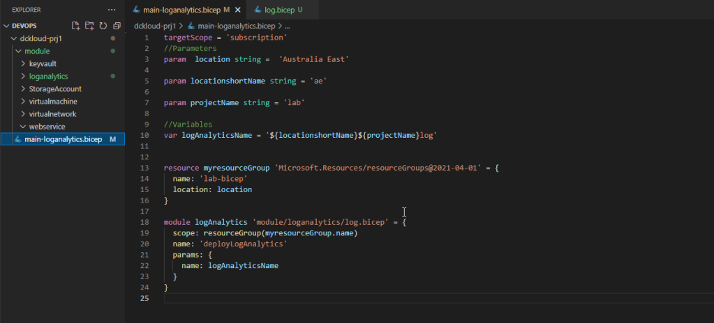
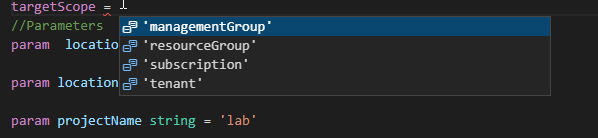
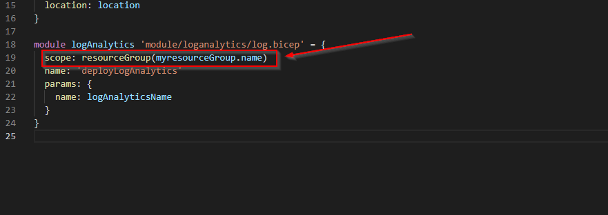

Recently I got to chance to work with Azure Bicep. I previously had experience with ARM templates. My first impression to Bicep was "WOW", It seems pretty cool and I started enjoying scripting with Bicep, but there were some moments that I felt some bad feelings. All in all its pretty awesome :)

So Started writing this blog to show how to best use Bicep templates. I have a similar vlog series also.

My aim in this blog series to build a full working environment with Bicep having all the bits and pieces tied together and later on may be we can tidy up few things.

Following is the environment I want to build

when using bicep we can create modules and main files. what happens is we can call modules in main files or within separate module files. Similar to OOP :)

quoting MS Documentation about Modules

"Bicep enables you to break down a complex solution into modules. A Bicep module is just a Bicep file that is deployed from another Bicep file. You can encapsulate complex details of the resource declaration in a module, which improves readability of files that use the module. You can reuse these modules, and share them with other people. Bicep modules are converted into a single Azure Resource Manager template with [nested templates](https://docs.microsoft.com/en-us/azure/azure-resource-manager/templates/linked-templates#nested-template) for deployment"

as per me modules can be a bicep file which we can call from another bicep files :D

Normally we define modules based on the workload. as per my above diagram I will have

- Log Analytics
- Virtual network
- Network Security groups
- Key Vault
- Storage account
- Storage account Private endpoints
- VM

and I will have few main files to call them

So lets start with the implementation. First things first we need to create our folder structure. As per below I have created my folder structure.

Now... before you start you need to understand the components you are going to deploy and its dependencies. So when looking at my above design I need my logAnalytics to be deployed first.

So I'm creating my log analytics bicep module as below

you may be wondering how I know all these, its pretty easy you have two options when you are learing.

1. Go ahead and deploy a workspace using GUI. and head down to export template, you can get a pretty good understanding what parameters required, you cannot copy paste simply because that export template is from json format not BICEP

And to get the related code for bicep head down to the MS documentation from below link

https://docs.microsoft.com/en-us/azure/templates/

Perfect, now since we done with module lets work on our main files for the loganalytics

this main file will not only call for this module but it will going to create a resource group as well

once you finish with the main file we can deploy few things to highlight my main file. this main file **_scope is subscription_**. there are few scope types available as per below

reason is because I'm creating a resource group also. But when deploying log analytics workspace its scope should be a resource group.

If you are wondering what this means is "resourceGroup(myresourceGroup.name)" it is a function available in BICEP. head out to the below link to learn more about bicep functions

https://docs.microsoft.com/en-us/azure/azure-resource-manager/bicep/bicep-functions

To deploy the bicep template. I just need to run the main file. Bicep will do the rest. I'm going to use Az module to deployment the bicep. Since my main file is a subscription scop this code is for subscription deployment

az deployment sub create --location australiaeast --template-file .\\dckloud-prj1\\main-loganalytics.bicep

for more info - https://docs.microsoft.com/en-us/azure/azure-resource-manager/bicep/deploy-cli

I will have these avaible in my github public repo

https://github.com/dkmcw20/AzurePS/tree/main/DevOps/dckloud-prj1

Also I have recently done a video explain this. please click the link below

https://youtu.be/9Z\_hcP8by4c

In the next part we will discuss about the things for the VNET and Storage accounts
