Recently I have delivered a session on Azure Virtual Desktop App Attach. Its quite fascinating. If we look at the solution carefully which you will realize with MSIX app attached AVD will become almost a management less solution. in this we are separating the apps from base operating system.

[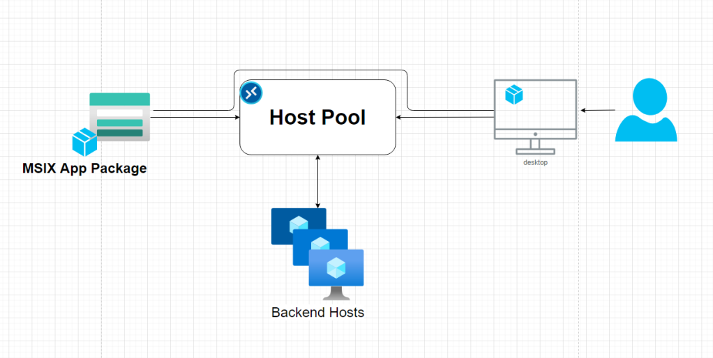](https://hungryboysl.wordpress.com/wp-content/uploads/2021/10/image-19.png)

With MSIX app attach,

- You don’t need to maintain gold images
- You can attach same package to multiple hosts
- Could save more on storage and maintaining storage and updates
- Etc

So, before we get into how to do this

You need to know what MSIX, and App attach is means

- MSIX – MSIX is the next generation format of application packages, previously we have MSI and now MSIX, what’s different with MSIX is, application is running in a containers
- App attach - App attach is the method of delivery for MSIX packages to the AVD

**Pre-requests**

1. App packaging environment
2. MSIX packaging tool
3. Working Azure Virtual desktop solution integrated with and Active Directory Domain Services.
4. Storage Accounts to host the packages in cloud
5. A Certificate (Prefer if you can have a public signed certificate)

**Preparing the packaging environment**

If you are using Hyper-V, you can use hyper v quick create to use Microsoft’s pre setup template of app packaging

[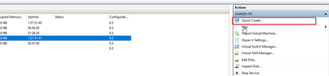](https://hungryboysl.wordpress.com/wp-content/uploads/2021/10/image-18.png)

[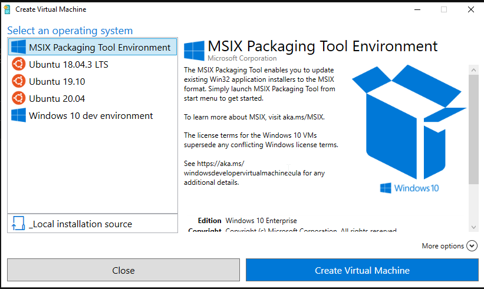](https://hungryboysl.wordpress.com/wp-content/uploads/2021/10/2021-10-15-16_02_53-window.png)

[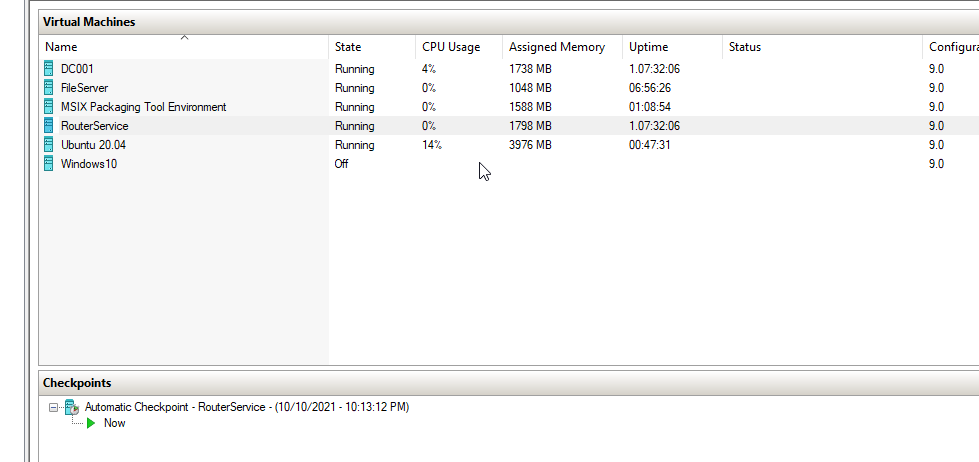](https://hungryboysl.wordpress.com/wp-content/uploads/2021/10/2021-10-15-16_03_35-window.png)

If you use that option, you will get VM as shown above, this VM will only have the required tools and the basic. Specially the “MSIX Packaging Tool”

Let begin. :D

Login to the App packaging VM and open “MSIX Packaging Tool” and select Create

[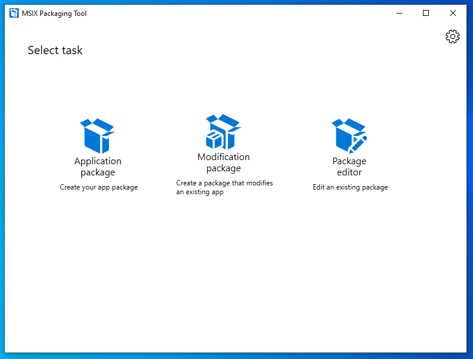](https://hungryboysl.wordpress.com/wp-content/uploads/2021/10/2021-10-15-16_15_21-window.png)

And follow the instructions as below

[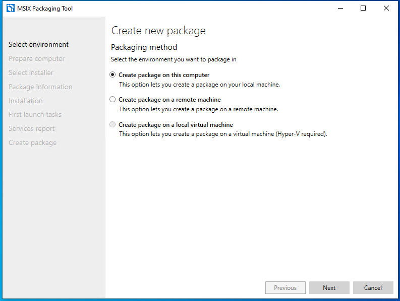](https://hungryboysl.wordpress.com/wp-content/uploads/2021/10/2021-10-15-16_16_17-window.png)

[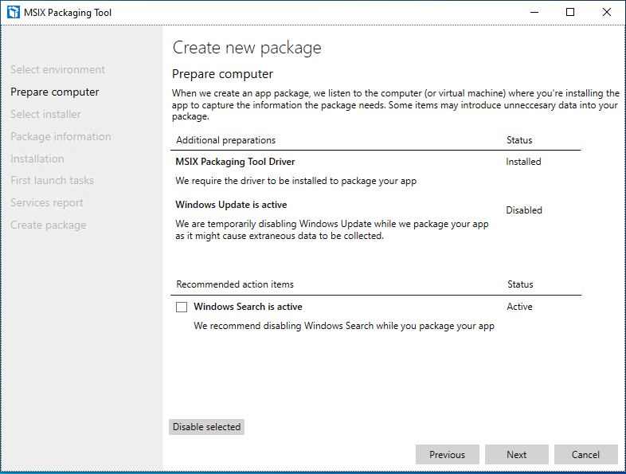](https://hungryboysl.wordpress.com/wp-content/uploads/2021/10/2021-10-15-16_23_15-window.png)

Now select the installer.

[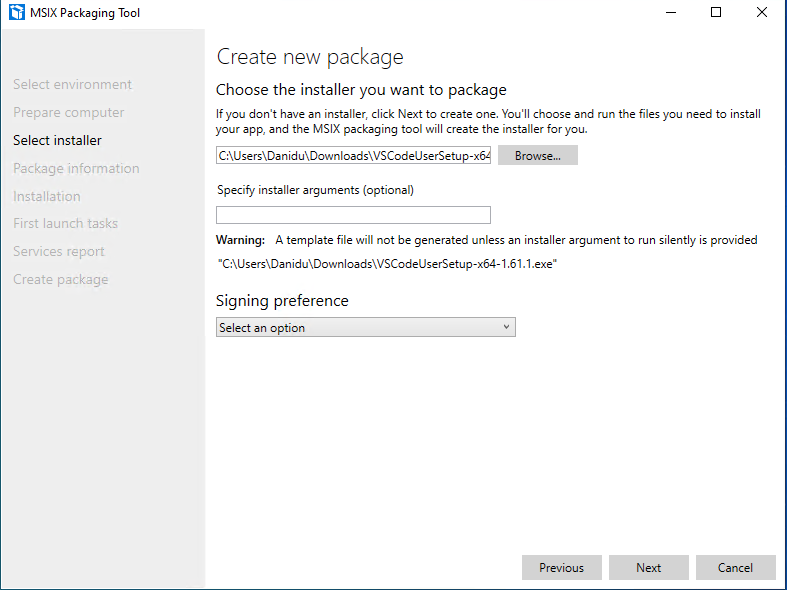](https://hungryboysl.wordpress.com/wp-content/uploads/2021/10/2021-10-15-16_24_04-window.png)

And down the bottom selects your PFX file to sign the package. This is mandatory to sign the package and what you need to keep in mind is your cert needs to be code signing enabled as below if not package signing will failed

[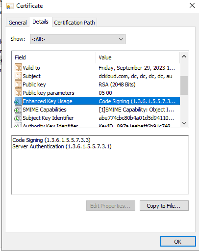](https://hungryboysl.wordpress.com/wp-content/uploads/2021/10/2021-10-15-16_28_37-window.png)

Fill in the package details as you need

[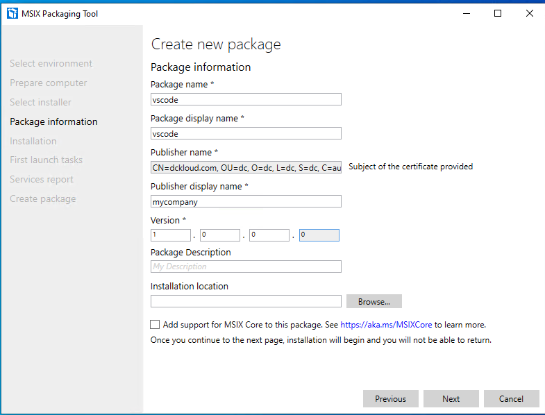](https://hungryboysl.wordpress.com/wp-content/uploads/2021/10/2021-10-15-16_31_19-window.png)

Once you hit next, wizard will automatically launch the installer, what will happen at the same time tool will create a snapshot of the system and start capturing all the changes after that point until we confirm the application installation is completed. Just install the application as normal hear I’m installing visual studio code

[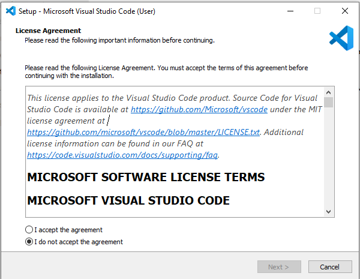](https://hungryboysl.wordpress.com/wp-content/uploads/2021/10/2021-10-15-16_41_44-window.png)

Once the setup completed, tool will automatically identify its been completed and prompt you with below

[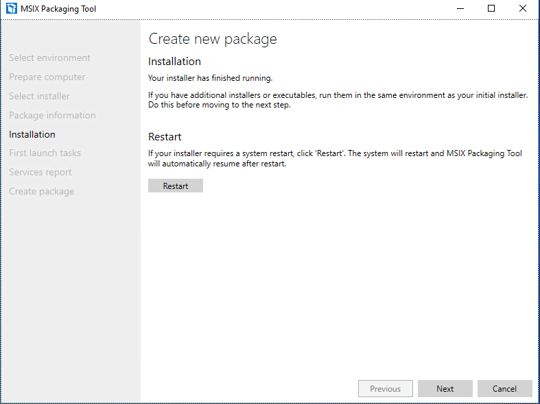](https://hungryboysl.wordpress.com/wp-content/uploads/2021/10/2021-10-15-16_42_58-window.png)

If you are done with packaging hit next, and as I mentioned packing tool will look for all the changes withing the window

[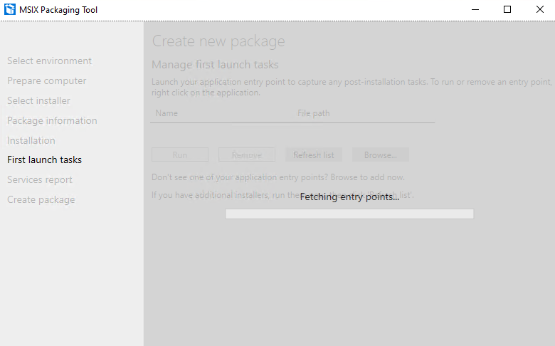](https://hungryboysl.wordpress.com/wp-content/uploads/2021/10/2021-10-15-16_43_32-window.png)

Select “Yes Move on” and it will prepare our MSIX Package.

[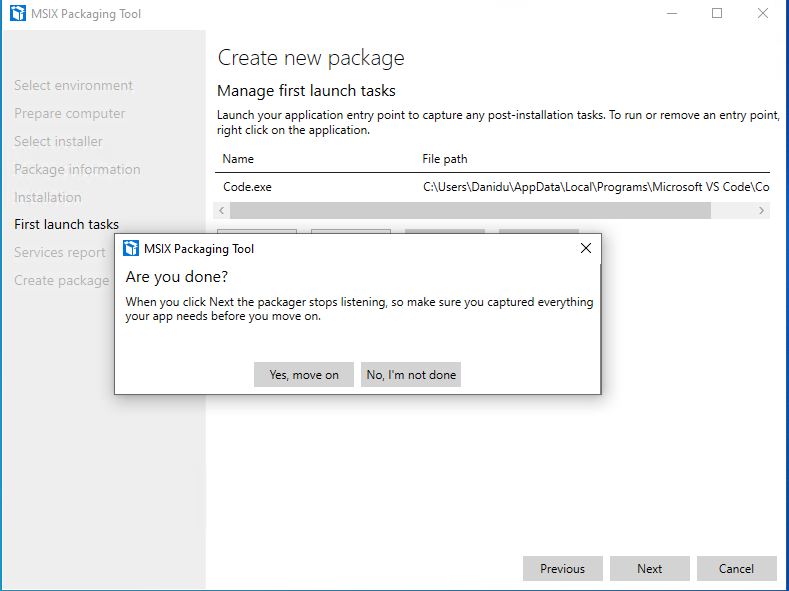](https://hungryboysl.wordpress.com/wp-content/uploads/2021/10/2021-10-15-16_44_19-window.png)

I have skipped few screenshots, just to keep things short once done you need to select the destination

[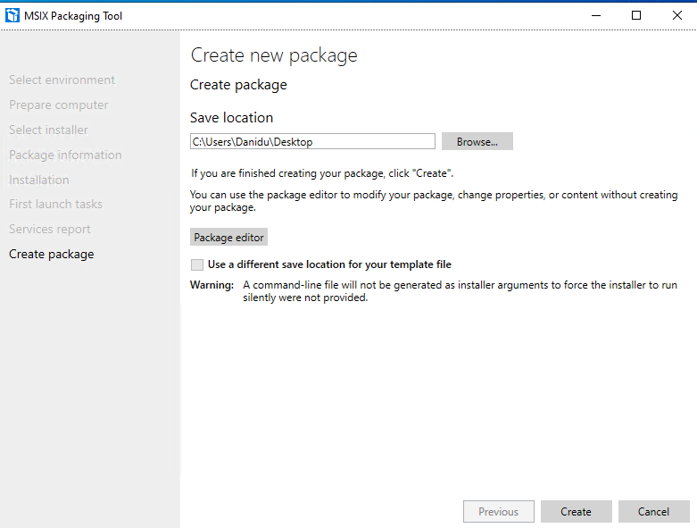](https://hungryboysl.wordpress.com/wp-content/uploads/2021/10/2021-10-15-16_45_20-window.png)

If the packaging is successful, it will provide the below notification confirming the packing

[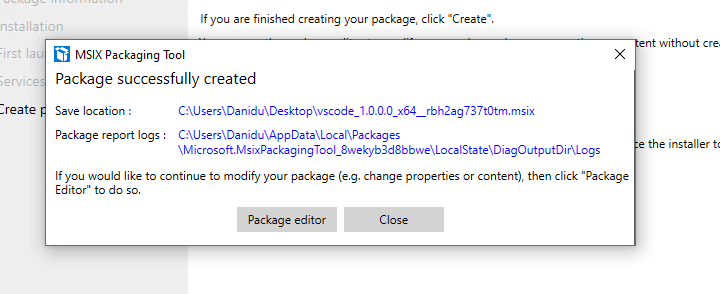](https://hungryboysl.wordpress.com/wp-content/uploads/2021/10/2021-10-15-16_46_58-window.png)

In the next articles. let’s deep dive into how to convert this MSIX and use it in our AVD Environment.

Continued…
