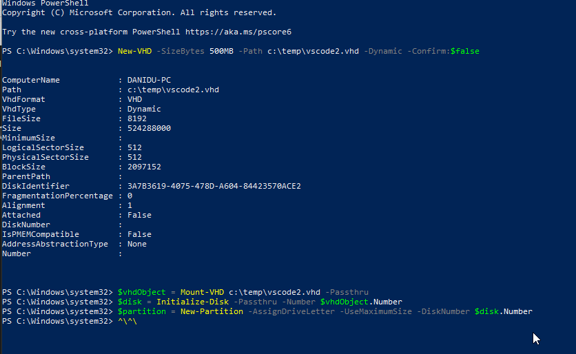
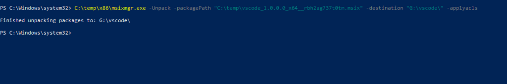
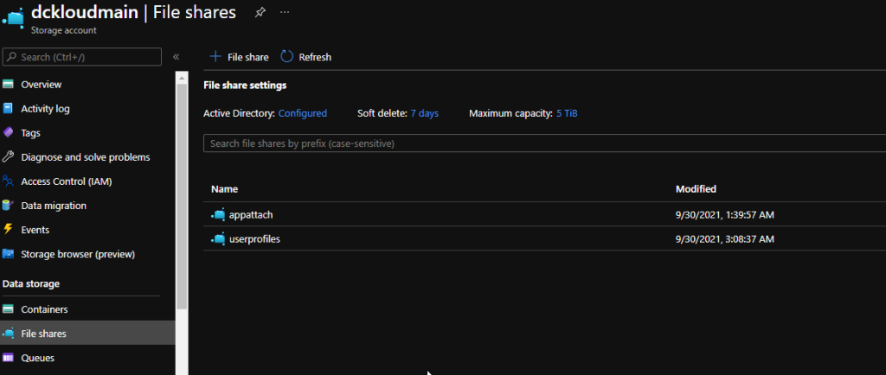
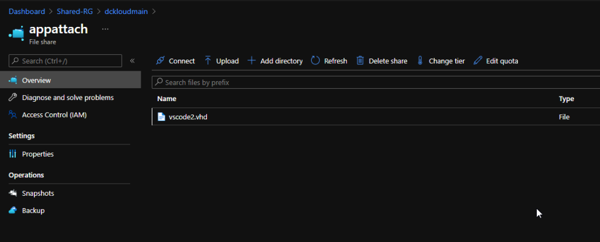
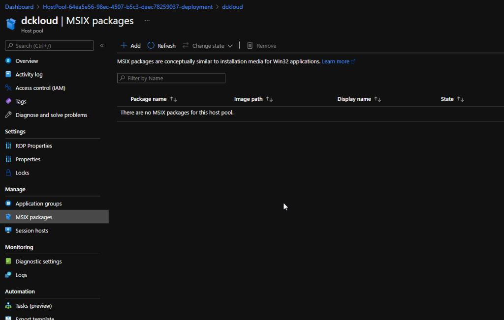
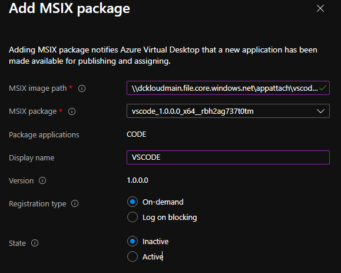
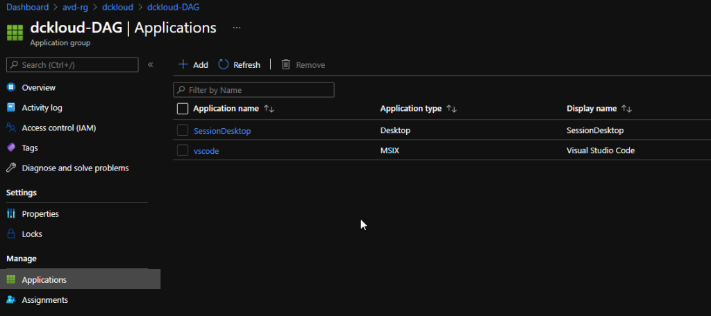
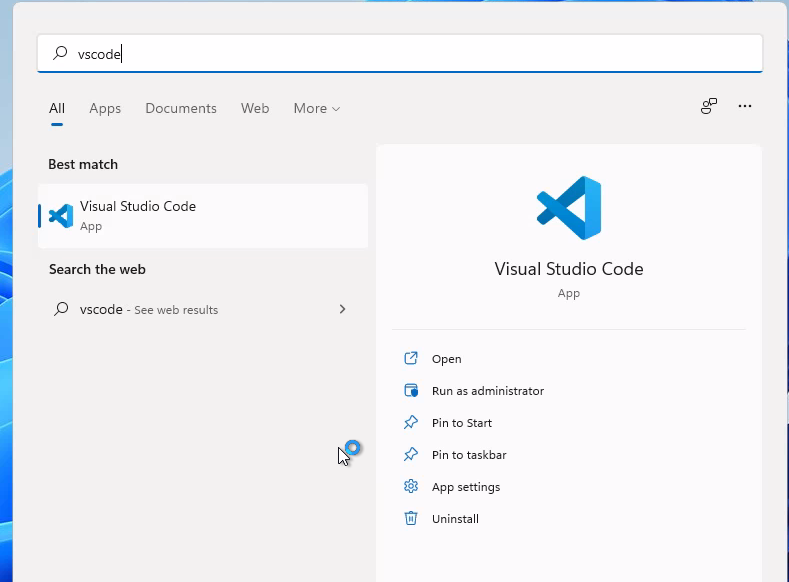

Welcome to the part two of the MSIX App attach

So, in our previous blog we have discussed how to create the MSIX package from the packaging tool. Now its time for us to deploy the MSIX to our AVD solution.

Before we proceed there are few things that you need to know, you need to have a storage account and a file share inside that integrated with out AD and with the relevant permission. Please follow the below steps from Microsoft to configure the required permissions for your MSIX app attach container.

https://docs.microsoft.com/en-us/azure/virtual-desktop/app-attach-file-share

Having said that I have already setup my file share,

Okay let’s get down to the business. :D

Since we have the package ready, we need to create VHD to extract the data.

I’m using the below script to create a VHD in host environment or you can simply attach a VHD to your packaging environment.

New-VHD -SizeBytes 500MB -Path c:\\temp\\vscode2.vhd -Dynamic -Confirm:$false

$vhdObject = Mount-VHD c:\\temp\\vscode2.vhd -Passthru

$disk = Initialize-Disk -Passthru -Number $vhdObject.Number

$partition = New-Partition -AssignDriveLetter -UseMaximumSize -DiskNumber $disk.Number

Once our VHD ready, we need to extract our MSIX to the VHD

To expand the MSIX image:

1. Download the msixmgr tool and save the .zip.
2. Unzip the msixmgr tool .zip folder.
3. Run the following cmdlet to unpack the MSIX into the VHD you created in the previous section.

.\\msixmgr.exe -Unpack -packagePath “C:\\temp\\vscode\_1.0.0.0\_x64\_\_rbh2ag737t0tm.msix” -destination "G:\\vscode" -applyacls

Once done, we need upload this to the storage account we prepared by giving required permissions earlier

Once its uploaded, its just a matter of adding the MSIX package to the AVD environment.

So, there are two ways that we can achieve this,

Using the portal, we can simply add the application to the user’s workspace.

Follow the below step

Head down to Azure Virtual desktop and select the host pool, go to MSIX Packages And also before you add please do note you need at least 1 host server in your host pool for this to work

Click add and provide the MSIX VHD path from the storage account

Fill in the details and set state to Active

Once done you can create an application group and provide msix app name give permissions to the users. If you follow this path users will see the application in their AVD Workspace as a remote application. You'll need to do this for both desktop and remote app application groups. If you don’t add the MSIX app to the Virtual Desktop Group ( by default hostpool-DAG). Application wont display inside the host

And if you just want users to access outside the host session then you can create a new app group and assign the application. So application will be visible in workspace.

Hope this helps some one 😊
