Recently I was more looking into bicep side of things in Azure. And I wanted to deploy the bicep templates using azure DevOps. 😊

I came up with the following workflow to deploy the templates to Azure.

[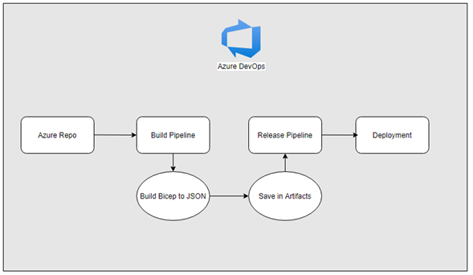](https://hungryboysl.wordpress.com/wp-content/uploads/2021/10/image-20.png)

I believe this approach is quite good because

1. Using the standard approach of build and deploy
2. I will get to see if there are any errors in bicep files during the build
3. Saving to artifacts will give the opportunity to go back instantly

## Azure DevOps Repository

I will be using a native Azure DevOps repository to hold the bicep code. Feel free to use GitHub also if you prefer.

I have created a new project inside my DevOps organization and uploaded the Bicep code

[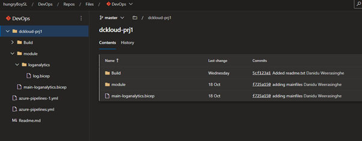](https://hungryboysl.wordpress.com/wp-content/uploads/2021/10/image-21.png)

## **Build Pipeline**

Idea behind this build pipeline is the represent the build stage by compiling the bicep code in to Arm template and will be saving json file inside the artefacts

Following are the steps

[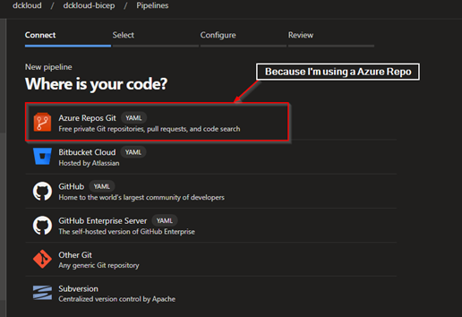](https://hungryboysl.wordpress.com/wp-content/uploads/2021/10/image-22.png)

<figure>

[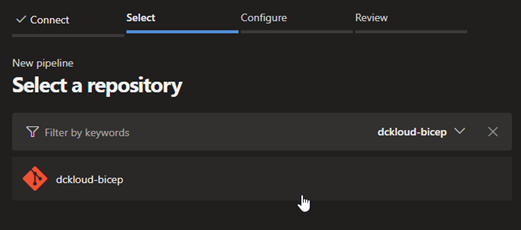](https://hungryboysl.wordpress.com/wp-content/uploads/2021/10/image-23.png)

<figcaption>

**_Select your azure repository_**

</figcaption>

</figure>

<figure>

[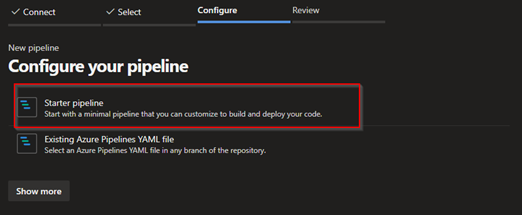](https://hungryboysl.wordpress.com/wp-content/uploads/2021/10/image-24.png)

<figcaption>

**_Select Starter Pipeline_**

</figcaption>

</figure>

<figure>

[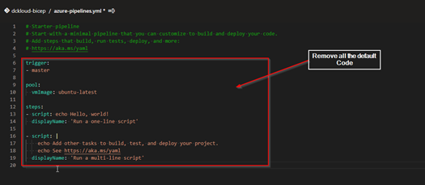](https://hungryboysl.wordpress.com/wp-content/uploads/2021/10/image-25.png)

<figcaption>

**_Remove the default code_**

</figcaption>

</figure>

<figure>

[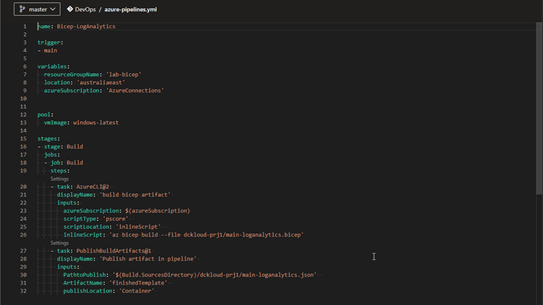](https://hungryboysl.wordpress.com/wp-content/uploads/2021/10/image-26.png)

<figcaption>

**_Enter the new Code as above_**

</figcaption>

</figure>

Note:  Code is saved in my public [GitHub](https://github.com/dckloud-repo/bicep-learning/blob/main/DevOps.yml). Head out there are and grab it

[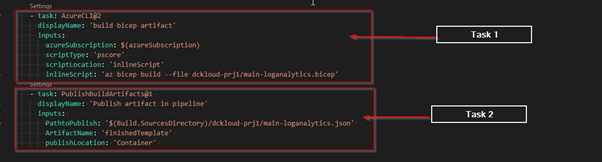](https://hungryboysl.wordpress.com/wp-content/uploads/2021/10/image-27.png)

My yml file does have 2 tasks

Task 1 - Compiling the bicep template into an arm template using Az PowerShell modules

Task 2 – Saving the converted ARM template into artifacts.

Once all done hit save and exit or you can run the pipeline to make sure everything works. Now let’s move to the deploy component

## Release Pipeline

In the release pipeline we will be using the successful built arm template in the above-mentioned phase to deploy it to the Azure. We will be selecting the ARM template from the Artifacts location and will be adding the ARM template deployment job.

Let look at how we can achieve this

<figure>

[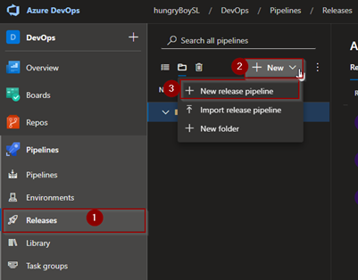](https://hungryboysl.wordpress.com/wp-content/uploads/2021/10/image-28.png)

<figcaption>

**_Create a new release pipeline_**

</figcaption>

</figure>

<figure>

[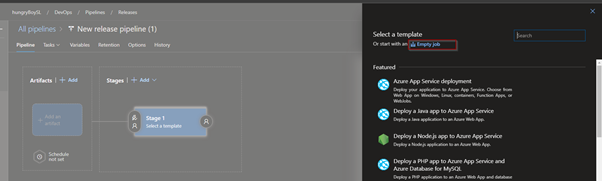](https://hungryboysl.wordpress.com/wp-content/uploads/2021/10/image-29.png)

<figcaption>

**_Select an Empty Job_**

</figcaption>

</figure>

<figure>

[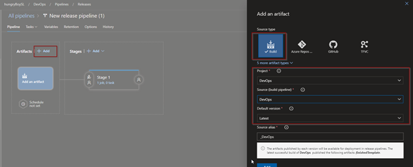](https://hungryboysl.wordpress.com/wp-content/uploads/2021/10/image-30.png)

<figcaption>

_**Add new**_ **_Artefacts and from the drop down select the build pipeline details_**

</figcaption>

</figure>

<figure>

[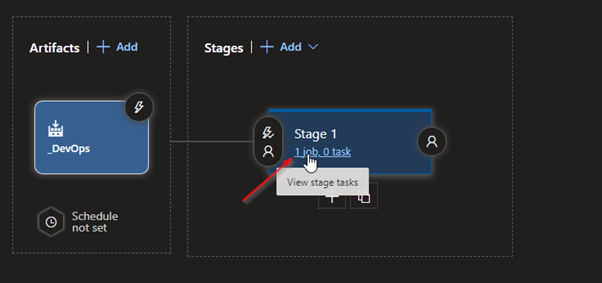](https://hungryboysl.wordpress.com/wp-content/uploads/2021/10/image-31.png)

<figcaption>

**_Select Jobs_**

</figcaption>

</figure>

<figure>

[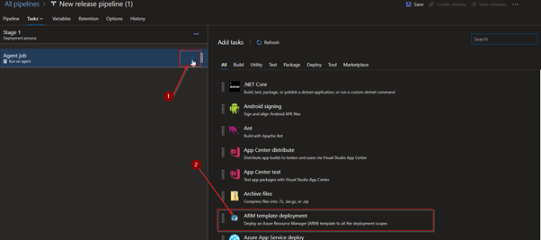](https://hungryboysl.wordpress.com/wp-content/uploads/2021/10/image-32.png)

<figcaption>

**_Add a new job and select ARM template deployment_**

</figcaption>

</figure>

<figure>

[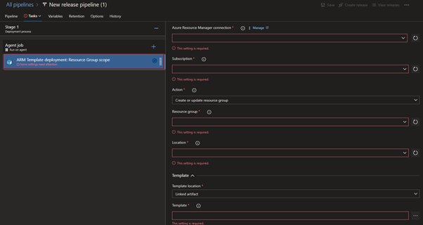](https://hungryboysl.wordpress.com/wp-content/uploads/2021/10/image-33.png)

<figcaption>

**_Select the selected job and fill the required details for you AZ subscription. Filled form is below._**

</figcaption>

</figure>

<figure>

[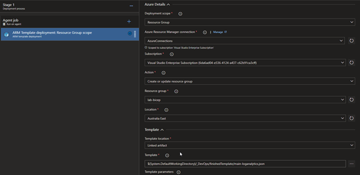](https://hungryboysl.wordpress.com/wp-content/uploads/2021/10/image-34.png)

<figcaption>

_**Note: When selecting the template section in the form you can hit the 3 dots in**_ **_In front of the text box and select our artefacts as below_**

</figcaption>

</figure>

**_Note: When selecting the template section in the form you can hit the 3 dots in Infront of the text box and select our artefacts as below_**

[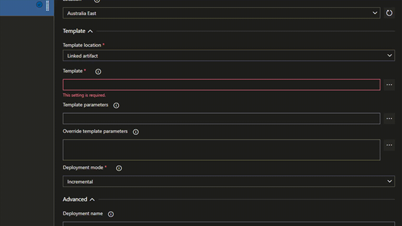](https://hungryboysl.wordpress.com/wp-content/uploads/2021/10/image-35.png)

**_Once done you are done with the configurations. Simply you are run the build pipeline and then the release pipeline. Based on the configurations you select your deployment will get completed._**

**_If you have any questions, please comment down below. Will get back to you as soon as possible_**
