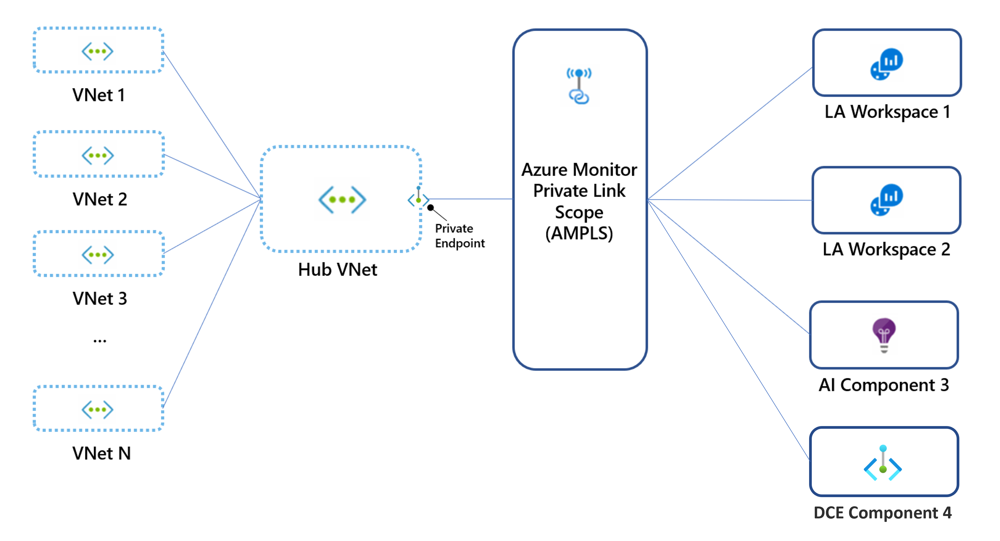

Howdy folks, It's been a while I blogged about something. And this time I'm here with Azure Monitor Services. The following diagram will explain most of it. Microsoft includes a few different services into Azure monitors, like Log Analytics, App, and VM Insights.


Azure Monitor collects two main types of details from Azure Services, Metrics, and Logs once it's being collected this data can be used to trigger alerts, diagnose issues, analyze trends, etc. This is one of the most critical and must-have services in Azure.

You can learn more about [Azure Monitor](https://docs.microsoft.com/en-us/azure/azure-monitor/overview)

Having said that we need to understand why Azure Monitor needs to be secured. Why it's so important.? Simply azure monitor will have many critical information types including users names, IP addresses, server names, etc. You may all agree on why this data needs security. Also, Microsoft have their own measures to secure the ingested log data to be secured ([link](https://docs.microsoft.com/en-us/azure/azure-monitor/logs/data-security))

There are a few options you are secure this service

- Network Isolation
- Access Controls (IAM)

## Network Isolation

Network Isolation can be configured with the help of private endpoints. But the interconnection with the azure monitor and private endpoint is slightly different from how we normally work with private endpoints. For that, we use an intermediate resource called Azure private link.

  
With Azure Private Link, we can securely connect Azure resources to a virtual network by using private endpoints. Azure Monitor is a group of different interconnected services (as mentioned before) that work as one to monitor the workloads. An Azure Monitor Private Link connects a private endpoint to a set of Azure Monitor resources, outlining the boundaries of the monitoring network. This is known as an Azure Monitor Private Link Scope (AMPLS)


With Private Links

- We can connect privately to Azure Monitor without opening up any public network access
- Access to monitoring data is only through authorized private networks
- Connect your private on-premises network to Azure Monitor using ExpressRoute/VPN and Private Link

There are a few things to keep in mind when configuring Azure private link scopes

1. Private links relies on private dns zones
    - Make sure you connects the Private link to the correct private DNS zone
    - Make sure you have correct connection from the DNS zone to the required virtual network

Microsoft does have separate documentation for the supported network [scenarios](https://docs.microsoft.com/en-gb/azure/azure-monitor/logs/private-link-design). Please make sure you understand the supported scenarios otherwise logs from the resources will not reach the insights or workspaces.

Personally, I prefer the below architecture. 1 links scope connected to the hub network and the traffic from the spoke network will also traverse thru the hub network. if your organizations that use a single global or regional DNS in fact have a single Private Link to manage traffic to all Azure Monitor resources, across all global, or regional networks via the hub network.

Log Services like log analytics workspace accepts inbound traffic from the resources, not only cloud but also on-prem services. When we enable private links, all the resources within the vNet or networks peered with the particular network can send the diag logs to the monitoring services.



There can be some cases you still need log ingestion to be possible via public networks for this also you do have a couple of options available

<figure>

[](https://hungryboysl.wordpress.com/wp-content/uploads/2022/01/image.png)

<figcaption>

When you disable public access for ingestion, no machine can send data to this component except those that are configured to send traffic through Azure Monitor Private Link.

</figcaption>

</figure>

When you disable public access for queries, no machine can access data in this component except those that are configured through Azure Monitor Private Link.

But as per my view if you enable these it defeats the purpose of having a private link scope and making the log vaults private. So try your best not to turn on these features

## Deploying Private Link Scope using PowerShell

You can use the below code to deploy the Private link scope to a log analytics workplace, And you need to edit this slightly to add similar Azure Monitor resources to the links space. Following code contains

1. Creating a Links Scope
2. Creating a Private Endpoint
3. Creting connection between private scope and Private endpoint
4. Creating the connection between log analytics workspace and link scope
5. Creating and Adding private DNS for Azre monitor

```
# scope details
$scopeSubscriptionId = ""
$scopeResourceGroup = ""
$scopeName = "AzureMonitor"
$scopeProperties = @{
    accessModeSettings = @{
        queryAccessMode     = "Open"; 
        ingestionAccessMode = "PrivateOnly"
    } 
}
$virtualNetworkName = 'test'
$logAnalyticsWorkspaceID = ''
$GroupID = 'Name of the Group'

# login to Azure Portal
Connect-AzAccount

# select subscription
Select-AzSubscription -SubscriptionId $scopeSubscriptionId

# create private link scope resource
$scope = New-AzResource -Location "Global" -Properties $scopeProperties -ResourceName $scopeName `
    -ResourceType "Microsoft.Insights/privateLinkScopes" -ResourceGroupName $scopeResourceGroup -ApiVersion "2021-07-01-preview" -Force

$vnet = Get-AzVirtualNetwork -name $virtualNetworkName
$vnet.Subnets[0].PrivateEndpointNetworkPolicies = "Disabled"
$vnet | Set-AzVirtualNetwork

#Creating a lInk Service Connection
$linkServiceConnectionParam = @{
    Name                 = 'myConnection'
    PrivateLinkServiceId = $scope.ResourceId
    GroupID              = $GroupID
}
$privateEndpointConnection = New-AzPrivateLinkServiceConnection @linkServiceConnectionParam

#Creating a New Private Endpoint
$PrivateEndpointParam = @{
    ResourceGroupName            = $scopeResourceGroup
    Name                         = 'PrivateEndPoint'
    Location                     = 'australiaEast'
    Subnet                       = $vnet.Subnets[0]
    PrivateLinkServiceConnection = $privateEndpointConnection
}
New-AzPrivateEndpoint @PrivateEndpointParam

######Creating Private DNS and Integrating with Virtual Network
## Create private dns zone. ##
$privateDNSParam = @{
    ResourceGroupName = $scopeResourceGroup
    Name = 'privatelink.azurewebsites.net'
}
$zone = New-AzPrivateDnsZone @privateDNSParam

## Create dns network link. ##
$dnsNetworkLinkParam = @{
    ResourceGroupName = $scopeResourceGroup
    ZoneName = 'privatelink.monitor.azure.com'
    Name = 'AzureMonitorLink'
    VirtualNetworkId = $vnet.Id
}
$link = New-AzPrivateDnsVirtualNetworkLink @dnsNetworkLinkParam

## Create DNS configuration ##
$dnsConfig = @{
    Name = 'privatelink.monitor.azure.com'
    PrivateDnsZoneId = $zone.ResourceId
}
$config = New-AzPrivateDnsZoneConfig @dnsConfig

## Create DNS zone group. ##
$dnsZoneGroup = @{
    ResourceGroupName =  $scopeResourceGroup
    PrivateEndpointName = 'PrivateEndPoint'
    Name = 'AzureMonitorZone'
    PrivateDnsZoneConfig = $config
}
New-AzPrivateDnsZoneGroup @dnsZoneGroup

#Add Link Scope to the Log Analytics Workspace
New-AzInsightsPrivateLinkScopedResource -LinkedResourceId $logAnalyticsWorkspaceID -ResourceGroupName $scopeResourceGroup -ScopeName $GroupID 
```

## **Summary**

As I explained above this configuration is a must-have in your Azure environments which will provide more protection to the log and metric data.

Please make sure.

1. You add the private endpoint to the correct private DNS Zone
2. Make sure you use 1 link scope to all the monitor resources ina subscription as mentioned above
3. I would recommed to use the above mentioned network architecture to create connections

As always... please comment down below if you have any questions or If I'm wrong :D

Next time its gonna be about deploying these controls via CI/CD and Bicep :D

Until next time...
