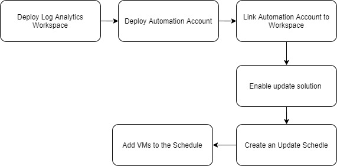

Howdy folks,

Back again with a new blog post. This time it's about Azure VM Guest and VM host update management during the VM deployment process. I'm writing this blog assuming you have a good understanding of how to manage Azure VM updates from Azure

In a recent project, there was a requirement to create an environment for a software deployment solution. And as part of the solution, automatic VM update is among one of the requirements.

There are great articles from Microsoft and as well as other consultants on how to manage windows update in Azure, this article is slightly different and explain how to achieve this via pipeline

Without further due following are the key component we need to set up.

| Component | Deployment Method |
| --- | --- |
| Log Analytics Workspace | BICEP |
| Automation Account | BICEP |
| Link Automation to Workspace | BICEP |
| Update Solution | BICEP |
| Provision Update Schedule | Azure Powershell command in the pipeline |
| Add enable updates for VM | Azure Powershell command in the pipeline |

As you can see there is an inter-dependency between automation account and workspace. So during my provisioning process, I followed below

[](https://hungryboysl.wordpress.com/wp-content/uploads/2022/02/z.jpg)

In this situation, I had to provision the log analytics workspace first to capture the automation account logs. And I had to use Powershell to execute the last two stages inside the pipeline

Following are the bicep templates. All 4 components were saved in 4 separate modules and using my main bicep file I have called the 4 modules. During the bicep deployment I had to set the dependencies to module files. Once the four modules are deployed I have added another stage to run the PowerShell scripts.

### Log Analytics Workspace

```
// Resource Definition
resource loganalytics 'Microsoft.OperationalInsights/workspaces@2020-08-01' = {
  name: workspaceName
  location: location
  tags: !empty(tags) ? tags : json('null')
  properties: {
    sku: {
      name: 'PerGB2018'
      capacityReservationLevel: (capacityReservation == 0) ? json('null') : capacityReservation
    }
    retentionInDays: retentionInDays
    features: {
      searchVersion: 1
      enableLogAccessUsingOnlyResourcePermissions: true
    }
  }
}
```

### Automation Account

```
resource automationAccount 'Microsoft.Automation/automationAccounts@2020-01-13-preview' = {
  name: autoAccountName
  location: location
  tags: !empty(tags) ? tags : json('null')
  identity: {
    type: 'SystemAssigned'
  }
  properties: {
    sku: {
      name: sku
    }
  }
}
```

### Link Autoamtion Account with Log Analytics

```
// Log Analytics Workspace Automation Link

@description('The name of the resource.')
param workspaceName string

@description('Location of the resource.')
param automationAccountName string

resource logAnalyticsAutomation 'Microsoft.OperationalInsights/workspaces/linkedServices@2020-08-01' = if (!empty(automationAccountName)) {
  name: '${workspaceName}/Automation'
  properties: {
    resourceId: resourceId('Microsoft.Automation/automationAccounts', automationAccountName)
  }
}
```

### Enable Update Solution

```
@description('Log Analytics Workspace ID')
param  logAnalyticsId string

@description('Log Analytics Workspace Name')
param logAnalyticsName string

@description('Location')
param location string

var updateManagementName = 'Updates(${logAnalyticsName})'

resource update 'Microsoft.OperationsManagement/solutions@2015-11-01-preview' = {
  name: updateManagementName
  location: location
  properties: {
    workspaceResourceId: logAnalyticsId
  }
  plan: {
    name: updateManagementName
    publisher: 'Microsoft'
    product: 'OMSGallery/Updates'
    promotionCode: ''
  }
}

#Note : One Special thing to not when deploying the solution. Name of the solution should be in following format 'Updates(${you_log_analytics_workspace_name})'. Otherwise the solution will not deploy and throw an error.

I have used below yml code to deploy the main bicep file.
```

I have used the below YML part to deploy the main bicep file (Note: my main yml file name is management.main.bicep)

```
- stage: Build_Management_Services
  jobs:  
  - job: buildManagement
    steps:
    - checkout: self
    - task: AzureCLI@2  
      displayName: 'Deploy Management Bicep Template File' 
      inputs: 
        azureSubscription: ${{ parameters.azureSubscription }}
        scriptType: 'pscore'  
        scriptLocation: 'inlineScript'  
        inlineScript: |
          az deployment sub create --location australiaeast `
          --template-file 'main/platform-services/management/management.main.bicep' `
          --parameters lzShortName=${{ parameters.lzShortName }} custShortName=${{ parameters.custShortName }} envShortName=${{ variables.envShortName }} `
            enablePaaSFirewall=${{ parameters.enablePaaSFirewall }} enableResourceLock=${{ parameters.enableResourceLock }} location=${{ parameters.location }}
```

[](https://hungryboysl.wordpress.com/wp-content/uploads/2022/02/image-1.png)

### Provision Update Schedule and Enable VM Updates (Inside the pipeline)

```
- stage: Enable_VM_Updates
  jobs:
  - job: enableVMUpdates
    steps:
    - checkout: self
    - task: AzureCLI@2
      name: enableVMBackups
      displayName: 'Enable VM Backups' 
      inputs: 
        azureSubscription: ${{ parameters.azureSubscription }}
        scriptType: 'pscore'  
        scriptLocation: 'inlineScript'
        inlineScript: | 
          $resourceGroup=Get-AzDeploymentOperation workloads.vm.app --query properties.outputs.rgName.value -o tsv
          $AutomationAccountName=Get-AzDeploymentOperation management.main --query properties.outputs.automationName.value -o tsv
          $logAnalytics=Get-AzDeploymentOperation subscription.main --query properties.outputs.logWorkspaceName.value -o tsv
          echo  $AutomationAccountName
          echo  $resourceGroupName
          $duration = New-TimeSpan -Hours 2
          $StartTime = (Get-Date "23:00:00").Adddays(1)
          Write-Host "Wait Until VM Extensions are enabled"
          Start-Sleep -Seconds 180
          $Schedule = New-AzAutomationSchedule -AutomationAccountName $AutomationAccountName -Name ${{ parameters.updateScheduleName }} -StartTime $StartTime -MonthInterval 1 -ResourceGroupName $ResourceGroup -DayOfWeekOccurrence ${{ parameters.weektoInstallUpdate }} -DayOfWeek Friday -TimeZone 'AUS Eastern Standard Time'
          $VMIDs = (Get-AzVM -ResourceGroupName $resourceGroup).Id 
          New-AzAutomationSoftwareUpdateConfiguration -ResourceGroupName $resourceGroup -Schedule $Schedule -Windows -AzureVMResourceId $VMIDs -Duration $duration -IncludedUpdateClassification Critical,Security,Definition,UpdateRollup,Updates -AutomationAccountName $AutomationAccountName -Verbose
        
```

[](https://hungryboysl.wordpress.com/wp-content/uploads/2022/02/image.png)

If you are re-using this code, you may need to fix the tabs accordingly in yml file as per below.

I haven't documented the full bicep deployment and main file creation. I'm guessing If you have come this far you have a good understanding in bicep language.

Finally, there are few more things to watch out

1. **Update solution Name - Name of the solution should be in following format 'Updates(${you\_log\_analytics\_workspace\_name})'. Otherwise the solution will not deploy and throw an error.**
2. **All 6 components required for this to work properly**
3. **Follow the component hirachy when deploying**

As always feel free to reach out to me to for any questions that you have. Or let me know If I have done a mistake

Untill next time......

For more information

https://docs.microsoft.com/en-us/azure/virtual-machines/automatic-vm-guest-patching

https://docs.microsoft.com/en-us/azure/automation/update-management/enable-from-template
