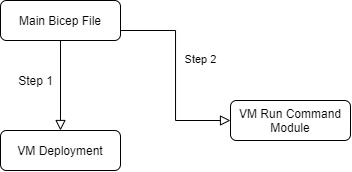

Hey Folks

Back again with a small blog, and I think this is a helpful solution too. Do you know when you provision data disks using Bicep template they are provisioned as raw disk..? So many of you provision the disks and handover to the dev or app team and they format the disk manually. But have you ever wondered if you can get the disk ready during the initial deployment itself.? **Yes, it is possible.**

There are many different ways to do it when you are doing it during the implementation, today I'm focusing on how to do this using bicep templates. For this, I'm leveraging a resource module that was recently released by Microsoft.

Which is, The virtualMachines/runCommands resource.

you can use this to Run PowerShell commands once you provision the VM. I guess now you know what is about to come. :D

You can get more details from the below link

https://docs.microsoft.com/en-us/azure/templates/microsoft.compute/virtualmachines/runcommands?tabs=bicep

In my lab setup, I have a few sub-modules,

1. Main Bicep File
2. VM Provision Module
3. Run Command Resource Module

My deployment structure is as follows

The main Bicep file will be calling the VM Deployment submodule and if that's is a successful Main file then again calls the VM run command module

[](https://hungryboysl.wordpress.com/wp-content/uploads/2022/02/untitled-diagram.jpg)

Here is my Main File

```
//Deploying required Virtual Machines to the Environnment

targetScope = 'subscription'

@description('appliction shortname. Used for resource naming.')
param appShortName string = 'ss'

@description('Customer shortname. Used for resource naming.')
param customerShortName string = 'dc'

@description('Shortname of evironment. Used for resource naming.')
param envShortName string = 'test'

@description('Domain Join User Name')
param domainJoinUserName string

@description('Domain Join User Secret Name to retrive it from KV')
param domainJoinSecretName string

@description('Local User Name')
param localAdminUserName string

@description('Local User Secret Name to retrive it from KV')
param localAdminSecretName string

@description('Domain to Join')
param domainToJoin string

@description('Service Principal Name for the SQL to Access the Key vault')
param sqlAkvPrincipalName string

@description('Service Principal Name for the SQL to Access the Key vault')
param sqlAkvPrincipalSecret string

@description('Virtual Machine Size')
param virtualMachineSize string = 'Standard_E2s_v3'

//existing resources Name
var logWorkspaceName = 'log-${appShortName}-${envShortName}-${custShortName}'
var storageName = toLower('st${appShortName}${envShortName}${custShortName}log')
var vnetName = 'vnet-${appShortName}-${envShortName}-${custShortName}'
var appSubnetName = 'snet-${appShortName}-${envShortName}-${custShortName}-app'
var dataSubnetName = 'snet-${appShortName}-${envShortName}-${custShortName}-data'
var keyvaultName = 'kv-${appShortName}-${envShortName}-${custShortName}'
var rgName = 'rg-${appShortName}-${envShortName}-${custShortName}'

//New Declarations
var appSubnetID = '/subscriptions/${subscription().subscriptionId}/resourceGroups/${rgName}/providers/Microsoft.Network/virtualNetworks/${vnetName}/subnets/${appSubnetName}'
var dataSubnetID = '/subscriptions/${subscription().subscriptionId}/resourceGroups/${rgName}/providers/Microsoft.Network/virtualNetworks/${vnetName}/subnets/${dataSubnetName}'
var logAnalyticsId = '/subscriptions/${subscription().subscriptionId}/resourceGroups/${rgName}/providers/Microsoft.OperationalInsights/workspaces/${logWorkspaceName}'
var storageUri = 'https://${storageName}.blob.core.windows.net/'
var virtualMachineNameSuffix = '${custShortName}${lzShortName}${envShortName}db'

//Reference Existing KeyVault
resource keyVault 'Microsoft.KeyVault/vaults@2019-09-01' existing = {
  scope: resourceGroup(rgName)
  name: keyvaultName
}

/New Declarations
var appSubnetID = '/subscriptions/${subscription().subscriptionId}/resourceGroups/${rgName}/providers/Microsoft.Network/virtualNetworks/${vnetName}/subnets/${appSubnetName}'
var dataSubnetID = '/subscriptions/${subscription().subscriptionId}/resourceGroups/${rgName}/providers/Microsoft.Network/virtualNetworks/${vnetName}/subnets/${dataSubnetName}'
var logAnalyticsId = '/subscriptions/${subscription().subscriptionId}/resourceGroups/${rgName}/providers/Microsoft.OperationalInsights/workspaces/${logWorkspaceName}'
var storageUri = 'https://${storageName}.blob.core.windows.net/'

//Reference Existing KeyVault
resource keyVault 'Microsoft.KeyVault/vaults@2019-09-01' existing = {
  scope: resourceGroup(rgName)
  name: keyvaultName
}

//Deploying Application Server
module appServer '../../../modules/virtual-machine/virtual-machine-windows.bicep' = {
  scope: resourceGroup(rgName)
  name: 'deploy_app_server'
  params: {
   // location:location
    adminPassword: keyVault.getSecret(localAdminSecretName)
    adminUsername: localAdminUserName
    domainToJoin: domainToJoin
    domainJoinUser: domainJoinUserName
    domainJoinPassword: keyVault.getSecret(domainJoinSecretName)
    dataDisksDefinition: [
      {
        createOption: 'empty'
        caching: 'ReadOnly'
        writeAcceleratorEnabled: false
        diskType: 'Premium_LRS'
        diskSize: 128
      }
    ]
    enableDomainJoin: true
    enableHybridBenefit: true
    logAnalyticsId: logAnalyticsId
    osDiskType: 'Premium_LRS'
    subnetId: appSubnetID
    useAvailabilityZones: false
    virtualMachineNameSuffix: virtualMachineNameSuffix
    virtualMachineSize: virtualMachineSize
    storageId: storageUri
  }
}

module initializeDisks '../../../modules/virtual-machine/virtual-machine-windows-runcommand.bicep' = {
  scope: resourceGroup(rgName)
  name: 'deploy_initialize_disks'
  params: {
    vmName: appServer.outputs.vmName
    script:'Get-Disk | Where-Object partitionstyle -eq "raw" | Initialize-Disk -PartitionStyle GPT -PassThru | New-Partition -AssignDriveLetter -UseMaximumSize | Format-Volume -FileSystem NTFS -Confirm:$false'
  }
}

output appServerName string = appServer.outputs.vmName
output rgName string = rgName

If you notice When I'm calling the run command module, I pass a powershell command to run which is going to initialze and format the disks
```

```
'Get-Disk | Where-Object partitionstyle -eq "raw" | Initialize-Disk -PartitionStyle GPT -PassThru | New-Partition -AssignDriveLetter -UseMaximumSize | Format-Volume -FileSystem NTFS -Confirm:$false'
```

The above command will get all the raw disks and format them to GPT NTFS file format. you can change the values as required

**Below is my run command module file**

```
@description('Name of the Virtual Machine')
param vmName string

@description('Script to Run')
param script string

@description('Script to Run')
@secure()
param runAsPassword string = ''
@description('Script to Run')
@secure()
param runAsUser string = ''

var name = '${vmName}/RunCommand'

resource runCommand 'Microsoft.Compute/virtualMachines/runCommands@2021-07-01' = {
  name: name
  location: resourceGroup().location
  properties: {
    asyncExecution: true
    source: {
      script: script
    }
    timeoutInSeconds: 300
    runAsPassword: empty(runAsPassword) ? json('null') : runAsPassword
    runAsUser: empty(runAsUser) ? json('null') : runAsUser 
  }
}
```

**_Summary_**

Looks this is a simple solution but, this method can come in very handy if you want to perform something inside the VM, by using this method we can avoid using DSC templates and make it very simple. All you need to do is pass the PowerShell command to run, and if you have a big script you can pass the Uri of the PowerShell file to Run :)

So hope this helps someone and comes in handy when you need it :D

As always please do reach out to me if you have any questions :)
