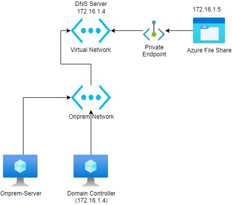
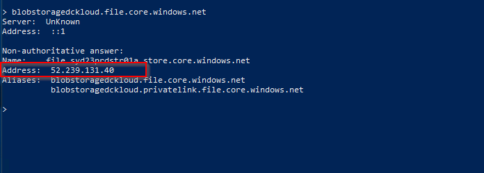
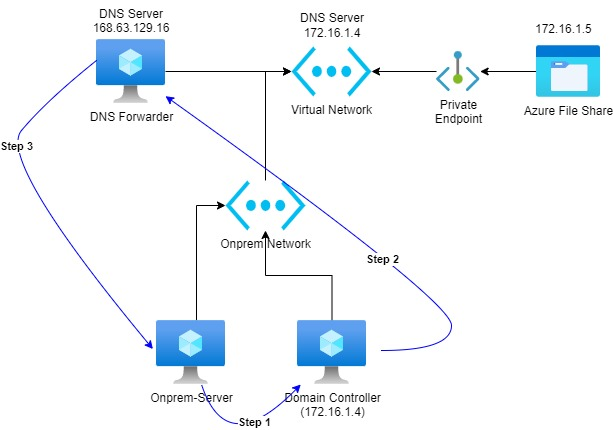

Howdy Folks

Again here with a Microsoft Azure product experience, this time it's about DNS resolutions. As you all know Microsoft Azure services have a networking feature called Private endpoints. This allows network users or services to access the MS-hosted services securely using a private IP address. I won't go into details on what and how to set up private endpoints and DNS.

## **_Problem to Solve_**

Azure storage account enabled a private endpoint and integrated it with private DNS. There are servers and used required to access this storage account using the private IP address (NOT THE PUBLIC ENDPOINT). A firewall is enabled on the storage account and this disabled the public access. Every time the on-prem server tries to access the storage account AD DNS resolves to the storage account's public IP address, not the local IP.

## **_Current Setup_**

## **_Current Behaviour from On-prem_**

## _**Resolution**_

At the moment, azure private DNS zones do not support setting up conditional forwarders. So the solution is to set up a DNS forwarder. And we need to provision this server inside an Azure virtual network that has a private DNS linked to it. Also, this server should be accessible from on-prem network Refer to the below document for the solution.

https://docs.microsoft.com/en-us/azure/private-link/private-endpoint-dns#virtual-network-and-on-premises-workloads-using-a-dns-forwarder

In Azure private endpoint, DNS resolution and some other DNS resolutions provided by one static IP belong to Microsoft (168.63.129.16) below article outlines the IP address details. Specially 168.63.129.16 will only respond to any query from Azure only.

https://docs.microsoft.com/en-us/azure/virtual-network/what-is-ip-address-168-63-129-16

**Step 1** \- Provisioned a new server and install DNS role in the newly provisioned server. Once done, Add the 168 IP as a forwarder in the new DNS server.

Below is the name resolution for our storage account from the new server. Looks like we can now resolve the private IP address of the storage account.

**Step 2 - The next step is to create a new conditional forwarder from the AD DNS to point to the new DNS server in Azure vnet**

Once this configuration is done, Servers using active directory DNS will be able to resolve to the private IP of the storage account.

This may not be an easy solution, but at the moment this is the only viable solution for this. Hopefully, in the future, we will be able to drop the intermediate DNS server part when it comes to name resolutions.

Untill next time...... :)
