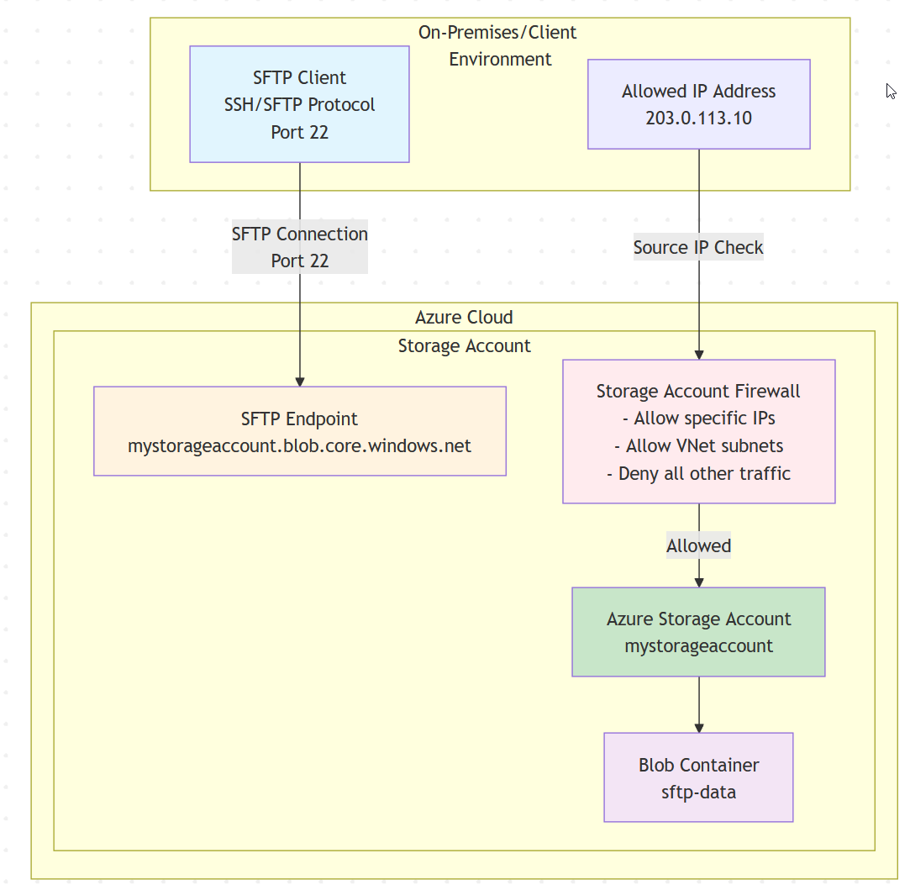

Howdy Folks

This time, I decided to play with Azure Virtual Desktops - FIDO key support feature. My experience with FIDO is also new. Luckily Fetian team hooked me up with one of their FIDO keys to test this solution. Firstly thanks heaps for the FEITIAN team

You can check out the FEITIAN lineup on their [Amazon Store here](https://domk.pro/aNB8F4).

I have used **[ePass FIDO NFC Security Key K9](https://www.ftsafe.com/Products/FIDO/NFC)**.

Following is my use case for the LAB

> - Configure FIDO key with my personal Hotmail account
> 
> - Enable FIDO key redirection with AVD
> 
> - Sign in to my personal Onedrive using the FIDO key within the Azure Virtual Desktop Session

## **Firstly About the K9 Key**

The K9 security key is a USB and NFC key. The setup of this key is really straightforward. Check this [blog post](https://www.azureblog.pl/2021/05/25/fido-feitian/) for the setup and the activation of using it in Azure AD. In terms of build quality, It's portable and easy to use, made out of hard plastic which makes it light weighted. I would suggest having a key ring or key tag attached otherwise you may lose the key :P

Also since it has **NFC** capability, so make sure you don't store it with other NFC devices

## AVD FIDO Support

Enabling AVD Fido support is fairly straightforward. You can achieve this either with Azure Active Directory joined or Hybrid AVD solutions

Azure Virtual Desktop supports in-session passwordless authentication (preview) using Windows Hello for Business or security devices like FIDO keys when using the Windows Desktop client. This feature is by default enabled on all the following AVD host deployments

- Windows 11 Enterprise single or multi-session with the 2022-09 Cumulative Updates for Windows 11 Preview (KB5017383) or later installed.

- Windows 10 Enterprise single or multi-session, versions 20H2 or later with the 2022-09 Cumulative Updates for Windows 10 Preview (KB5017380) or later installed.

- Windows Server 2022 with the 2022-09 Cumulative Update for Microsoft server operating system preview (KB5017381) or later installed.

## Experience

Once I signed in to the Azure Virtual Desktops, I tried signing into my personal Onedrive and selected the below option

At this stage I have my FIDO key plugged into my Laptop.

All I had to do was put the Pin in and touch the FIDO key. AVD redirection worked seamlessly

## Conclusion

All in all FEITIAN FIDO Key Setup and usage was seamless, I'm really pleased with how it worked well without any drama.:) . Look forward to checking out new products from FEITIAN. I may give it a go with Biometrics one too.

You can check out the FEITIAN lineup on their [Amazon Store here](https://domk.pro/aNB8F4).

And AVD Password less auth experience is also pleasant and easy for users. With this new feature, users will be able to sign in to their accounts more securely and seamlessly.
