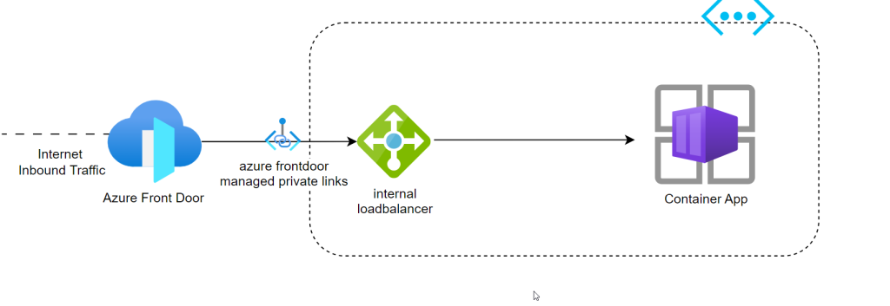
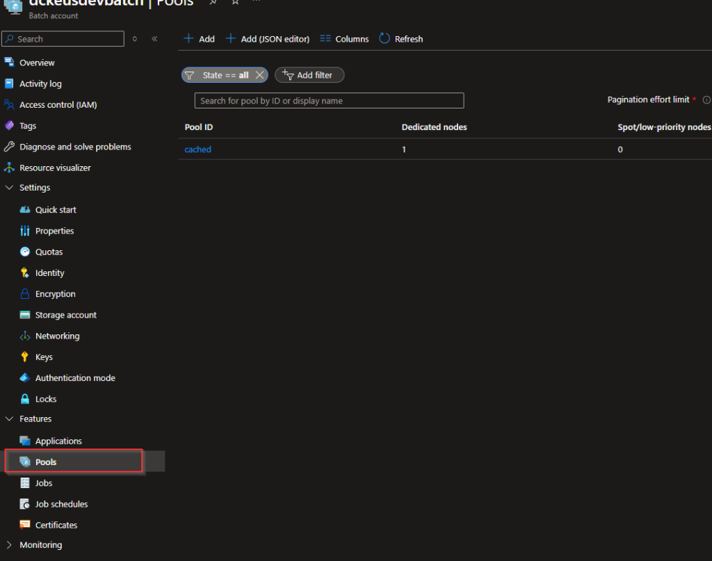

## Intro

Howdy Folks

Howdy folks! You may already know that maintaining your Bicep modules in Azure is crucial, and one powerful tool at your disposal is the Azure Container Registry (ACR). ACR is a managed, private container registry service provided by Microsoft Azure. It allows you to securely store and manage container images, seamlessly integrating with various Azure services like AKS, Azure Functions, and Azure App Service. With ACR, you can streamline your deployment processes, enhance reliability, and focus on delivering value to your customers.

ACR ensures the integrity and security of your container images by offering features like Azure AD integration, RBAC, and VNet service endpoints. It also supports geo-replication, enabling faster image pull times and ensuring availability even during regional outages. ACR Tasks automates image building, testing, and deployment, providing a streamlined and efficient workflow. Additionally, Azure Monitor allows you to monitor registry performance and gain valuable insights.

In summary, Azure Container Registry (ACR) is an essential tool for maintaining your Bicep modules in Azure. It provides secure storage, seamless integration with Azure services, and automation capabilities. By leveraging ACR, you can optimize your deployment processes, improve reliability, and focus on delivering high-quality solutions to your customers.

One of my good collogue already documented how to effectively use this in bicep environments. Please have a look how to effectively use it. :D

https://arinco.com.au/blog/azure-bicep-modules-with-container-registry/

## How to Maintain an Azure Bicep Registry

I'm going to talk about how to implement one using Azure Bicep and maintain it. :).

### My Plan of Attack

1. Start by creating an Azure DevOps repository where you will manage your Bicep modules and associated files. This repository will serve as the central location for version control and collaboration.

3. Use Azure Bicep, a domain-specific language for deploying Azure resources, to define and deploy your ACR instance. With Bicep, you can declaratively specify the desired state of your resources. This ensures consistent and repeatable deployments of your container registry.

5. Within the same repository, create a dedicated folder, such as "modules," to store all your Bicep modules. This approach helps maintain a centralized and organized structure for your modules, making it easier to manage and track changes.

7. Create a folder structure inside the modules folder to organize your modules. For example, you can create a versioned folder structure like "module/v1/<module>/<module>.bicep." This structure allows you to manage different versions of each module while keeping them easily accessible.

9. To upload the Bicep files into ACR, you can leverage a PowerShell script. This script should iterate through the modules folder, locate the Bicep files, and use the Azure CLI or Azure PowerShell module to push the Bicep files to your ACR instance. This process ensures that the latest versions of your Bicep modules are available in the registry for deployment.

11. Create an Azure DevOps pipeline to automate the execution of the PowerShell script. Configure the pipeline to trigger on changes to the modules folder or any other desired event. This pipeline will ensure that the script runs automatically, keeping your ACR up-to-date with the latest Bicep module versions.

I believe by following these steps, you can establish a seamless workflow for maintaining and deploying Bicep modules using Azure Container Registry. This approach allows you to version control your modules, keep them organized within a single repository, and leverage PowerShell scripts to automate the process of uploading the Bicep files into ACR.

## Implementation

I have created below module file for ACR and its quite simple to a really basic registry. deployed this using Azure DevOps.

[](https://hungryboysl.wordpress.com/wp-content/uploads/2023/06/image.png)

```
@description('ACR Name')
param acrName string

@description('Location Name')
param location string

@description('SKU Name')
@allowed(
  [
    'Standard'
    'Premium'
    'Classic'
    'Basic'
  ]

)
param skuName string = 'Basic'

resource acr 'Microsoft.ContainerRegistry/registries@2023-01-01-preview' = {
  name: acrName
  location: location
  sku: {
    name: skuName
  }
  identity:{
    type:'SystemAssigned'
  }
  properties:{
    
  }
}

```

But if you feel like you need more options feel free to add components into the module. Since I'm deploying a basic SKU registry, I don't have the full options available. Following properties are available as part of the 2023-01-01 API.

[](https://hungryboysl.wordpress.com/wp-content/uploads/2023/06/image-1.png)

I deployed the bicep file using azure devops pipeline. You can Feel free refer to one of my previous blogs to check out how to deploy bicep using Azure Devops.

https://hungryboysl.wordpress.com/2023/03/31/updating-azure-vm-data-disk-sizes/

### Folder Structure

As I mentioned above, I have come up with below Folder structure. Because of two reasons

1. Keep Module files separate for different resources.

3. Maintain different versions easily.

"module/<version>/<module>/<module>.bicep."

and this will be helpful to our PowerShell script too :D

[](https://hungryboysl.wordpress.com/wp-content/uploads/2023/06/image-3.png)

[](https://hungryboysl.wordpress.com/wp-content/uploads/2023/06/image-2.png)

### PowerShell Script

Below PowerShell script automates the process of publishing Bicep modules to an Azure Container Registry (ACR). The script follows a specific folder structure where the Bicep files are organized under the `/modules/<version>/<module>/<module>.bicep` path.

Here's a breakdown of how the script works:

1. Variables: The script starts by defining variables such as the subscription ID, resource group name, ACR name, base path for module files, Bicep file extension, and ACR login server.

3. Connect to Azure: The script connects to Azure using the `Connect-AzAccount` cmdlet and selects the specified Azure subscription using `Set-AzContext`.

5. Retrieve Bicep Files: The script scans the base path and recursively searches for Bicep files matching the specified file extension (`*.bicep`). It collects a list of these files for further processing.

7. Publish Bicep Modules: For each Bicep file, the script enters a loop to publish the Bicep module to the ACR. It extracts the version and module name from the file path using the `Split-Path` cmdlet. Then, it constructs the Docker image name and tag based on the module name and version.

9. Publish-AzBicepModule: The script uses the `Publish-AzBicepModule` cmdlet to publish the Bicep module. It passes the Bicep file path and the target Docker image, which includes the ACR login server, the module path, and the image tag.

11. Output: After each successful module publication, the script displays a message indicating the successful publishing of the Bicep module.

You can customize the script by updating the variables to match your specific environment, including the subscription ID, resource group name, ACR name, and ACR login server. Additionally, ensure that the folder structure for the Bicep files matches the expected pattern (`/modules/<version>/<module>/<module>.bicep`).

```
# Set variables
$subscriptionId = ""
$basePath = ".\modules"
$bicepFileExtension = ".bicep"
$acrLoginServer = "<ACR NAME>.azurecr.io"

# Connect to Azure
Connect-AzAccount

# Select Azure subscription
Set-AzContext -SubscriptionId $subscriptionId

# Get the list of Bicep files in the base path
$bicepFiles = Get-ChildItem -Path $basePath -Filter "*$bicepFileExtension" -Recurse

# Loop through each Bicep file
foreach ($bicepFile in $bicepFiles) {
    # Publish Bicep module
    $bicepFilePath = $bicepFile.FullName
    Write-Host "Publishing Bicep module: $bicepFilePath..."

    # Extract version and module name from the file path
    $version = (Split-Path $bicepFile.Directory.Parent.FullName -Leaf)
    $module = (Split-Path $bicepFile.Directory.FullName -Leaf)

    $imageName = $module
    $imageTag = $version
    $dockerImage = "br:${acrLoginServer}/bicep/modules/${imageName}:${imageTag}"

    Publish-AzBicepModule -FilePath $bicepFilePath -Target $dockerImage -Force

    Write-Host "Bicep module published successfully: $bicepFilePath"
}

As the final step we need to run this as part of an Azure pipeline. So this will keep our module registry up to date.

```

## Observations and Conclustions

> I have noticed following.
> 
> 1. It may take some time to upload the modules into ACR/ Depending on number of modules
> 
> 3. I have seen this take up to 2 to 3min upload some of the modules
> 
> 5. If you have special caracahers inside te module or as part of the name, there is a chance that upload may fail
> 
> 7. When during development it can become time consuming to update modules and refer the at the same time, because it can take time to update things.
> 
> But maintaining a container registry may help you down the line when maintaining and cleaning up modules.
> 
> You can check out the bicep files and PowerShell scripts from my GitHub repo.
> 
> https://github.com/DaniduWeerasinghe911/Azure-Bicep-Container-Registry

Container Registry Best Practices

https://learn.microsoft.com/en-us/azure/container-registry/container-registry-best-practices

Hope this helps someone :). If you have any questions hit me up. Happy to help anyway I can :)
