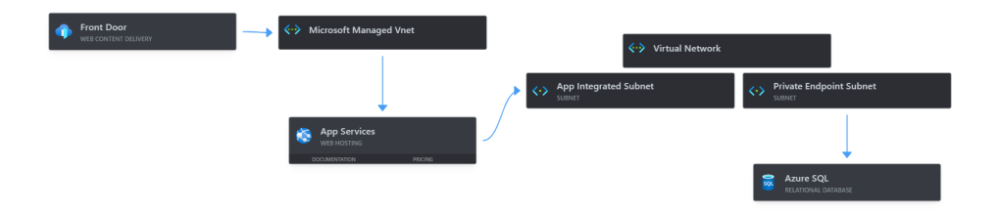

### Introduction

In the rapidly evolving digital landscape, the security of web applications has become paramount, especially in cloud environments. Azure, as one of the leading cloud platforms, offers a suite of tools and features designed to bolster the security of web applications. Understanding and implementing these features is not just a best practice; it's a necessity in safeguarding sensitive data and ensuring uninterrupted service.

This blog aims to demystify and delve into four critical Azure features:

- Azure Front Door with Private Links

- App Service VNet Integration and Private Endpoints

- SQL Server Private Endpoints

Each of these components plays a pivotal role in fortifying your web application against an array of security threats.

We will explore how Azure Front Door offers global, scalable entry-points that can secure your web applications, how App Service VNet Integration and Private Endpoints can enhance network security, and why TLS/SSL are foundational to protecting data in transit. By the end of this guide, you will have a comprehensive understanding of these features and how to effectively implement them to secure your Azure-hosted web applications end-to-end.

So, whether you are an Azure novice or a seasoned cloud professional, this blog will provide valuable insights and practical steps to elevate your web application security strategy within the Azure ecosystem.

### Feature 1: Azure Front Door

#### **Overview of Azure Front Door**

Azure Front Door is a scalable and secure entry point for web applications. It leverages Microsoft's global network to optimize web traffic, ensuring high availability and performance. Azure Front Door provides capabilities like routing, URL-based forwarding, and session affinity, which are crucial for modern web applications.

#### **Security Features**

One of the standout features of Azure Front Door is its security capabilities. It offers:

- **Web Application Firewall (WAF)**: Azure Front Door's WAF provides centralized protection of your web applications from common threats and vulnerabilities, such as SQL injection and cross-site scripting (XSS).

- **SSL Offloading**: This feature relieves your web application from the processing overhead of encrypting and decrypting SSL traffic, enhancing performance while maintaining security.

- **Global HTTP Load Balancing**: This ensures that user requests are directed to the nearest and most responsive application instance, reducing latency and improving user experience.

### Choosing Between Azure Front Door and Application Gateway

#### Cost-Effectiveness

- **Azure Front Door (AFD)** tends to be slightly more cost-effective compared to Azure Application Gateway. This aspect is particularly relevant for businesses looking to optimize their cloud spending without compromising on performance and security.

#### SSL Certificate Management

- **Free SSL Certificates with AFD**: A significant advantage of Azure Front Door is that it provides free SSL certificates and manages them. This not only reduces the cost associated with purchasing and renewing SSL certificates but also simplifies the operational overhead of managing these certificates.

- **SSL Management in Application Gateway**: While Application Gateway supports SSL termination and end-to-end encryption, managing SSL certificates (procuring, installing, and renewing them) typically falls under the responsibility of the user, which can add to the operational complexity and cost.

#### Conclusion

When deciding between Azure Front Door and Azure Application Gateway, consider the following:

- **Global Scale and Performance**: Opt for Azure Front Door if your priority is global load balancing with enhanced performance and reduced latency across multiple regions.

- **Regional Focus and Application-Level Load Balancing**: Choose Azure Application Gateway for scenarios requiring sophisticated application-level load balancing within a single region.

- **Cost and SSL Certificate Management**: If budget is a constraint and you're looking for a solution that provides free SSL certificates and handles their management, Azure Front Door presents a more appealing option.

In summary, Azure Front Door stands out for global reach, cost-effectiveness, and ease of SSL certificate management, making it an attractive choice for many global web applications. Azure Application Gateway, on the other hand, remains a robust choice for more region-specific applications that require advanced application-level load balancing.

#### **Implementing Private Links**

Private Links in Azure Front Door enhance security by allowing you to access your services over a private endpoint within the Azure network. This setup minimizes exposure to the public internet, significantly reducing the attack surface.

You may think why not Azure Application Gateway to keep things internal. When deciding between Azure Front Door and Azure Application Gateway, consider the following:

- **Global Scale and Performance**: Opt for Azure Front Door if your priority is global load balancing with enhanced performance and reduced latency across multiple regions.

- **Regional Focus and Application-Level Load Balancing**: Choose Azure Application Gateway for scenarios requiring sophisticated application-level load balancing within a single region.

- **Cost and SSL Certificate Management**: If budget is a constraint and you're looking for a solution that provides free SSL certificates and handles their management, Azure Front Door presents a more appealing option.

### Feature 2: App Service Vnet Integration and Private Endpoints

#### **Understanding VNet Integration**

Virtual Network (VNet) integration for Azure App Service allows you to securely connect your app service to resources in your Azure Virtual Network. This integration is key in scenarios where you need to access resources in your VNet, like SQL databases, or when you want to provide enhanced security for your web app.

#### **Security Advantages**

VNet Integration provides several security benefits:

- **Isolation**: It enables your app service to be isolated from the public internet, reducing exposure to external threats.

- **Secure Access to Resources**: You can securely access resources in your VNet, such as databases or other services, without exposing them to the public internet.

#### **Private Endpoints**

Private Endpoints in Azure create a private and secure connection to Azure services. They are particularly useful for:

- **Securing Connections**: Ensuring that traffic between your Azure services and Azure App Service stays on the Microsoft Azure backbone network.

- **Reducing Latency**: Since traffic doesn't traverse over the internet, it reduces latency and improves the performance of your applications.

### Feature 3: SQL Server Private Endpoints

Securing your database is as crucial as securing your web application. Azure provides robust mechanisms to safeguard your databases, with SQL Server Private Endpoints being a key feature. This section delves into what SQL Server Private Endpoints are and how they enhance the security of your database connections in Azure.

#### **Private Endpoints Explained**

Private Endpoints in Azure allow you to securely connect to services like Azure SQL Server over a private IP address within your Virtual Network (VNet). This means that your database communication can be completely isolated from the public internet, significantly reducing the risk of exposure to potential attacks.

#### **Setting Up Private Endpoints**

Setting up Private Endpoints for Azure SQL Server involves several steps:

1. **Create a Private Endpoint**: In your Azure VNet, create a new Private Endpoint and associate it with your Azure SQL Server.

3. **DNS Configuration**: Configure DNS settings to ensure that your Azure SQL Server is reachable through the Private Endpoint.

5. **Testing Connectivity**: Once set up, it's crucial to test connectivity to ensure that your application can communicate with the SQL Server via the Private Endpoint.

#### **Security Benefits**

The implementation of SQL Server Private Endpoints comes with several security advantages:

- **Reduced Attack Surface**: Since your database server is not exposed to the public internet, the attack surface is significantly reduced.

- **Data Exfiltration Protection**: Private Endpoints help in mitigating the risks of data exfiltration as all traffic to and from the SQL Server stays within Azure's network.

- **Compliance and Regulatory Requirements**: For businesses with stringent compliance and regulatory requirements, Private Endpoints provide an essential tool in ensuring that data is securely accessed and managed.

In this blog, we explored key Azure features critical for securing web applications, focusing on Azure Front Door with Private Links, App Service VNet Integration, and SQL Server Private Endpoints, along with the implementation of TLS/SSL. Azure Front Door enhanced security through its global load balancing, integrated Web Application Firewall, and SSL offloading, further supported by Private Links for secure, private access. App Service VNet Integration provided an added layer of security, offering isolation and secure access to resources within Azure's network, while Private Endpoints ensured secure, private connectivity for both the App Service and SQL Server, reducing exposure to the public internet.

Moreover, the implementation of SQL Server Private Endpoints significantly reduced the attack surface by enabling secure database communications within Azure's private network. The blog also highlighted Azure Front Door's cost-effectiveness and its provision of free, managed SSL certificates, marking it as a compelling choice for global web applications in need of optimized performance and heightened security. Together, these Azure services formed a robust framework for securing web applications, ensuring data protection, compliance, and resilience against evolving cyber threats.

I have also templated this solution using Azure Bicep. You can access my [GitHub](https://github.com/DaniduWeerasinghe911/Azure-Secure-Web-App) repo.

Microsoft Documentations

[https://learn.microsoft.com/en-us/azure/frontdoor/private-link](https://learn.microsoft.com/en-us/azure/frontdoor/private-link)

[https://learn.microsoft.com/en-us/azure/private-link/tutorial-private-endpoint-sql-portal](https://learn.microsoft.com/en-us/azure/private-link/tutorial-private-endpoint-sql-portal)

As always please reach out if you have any questions. Until next time........
