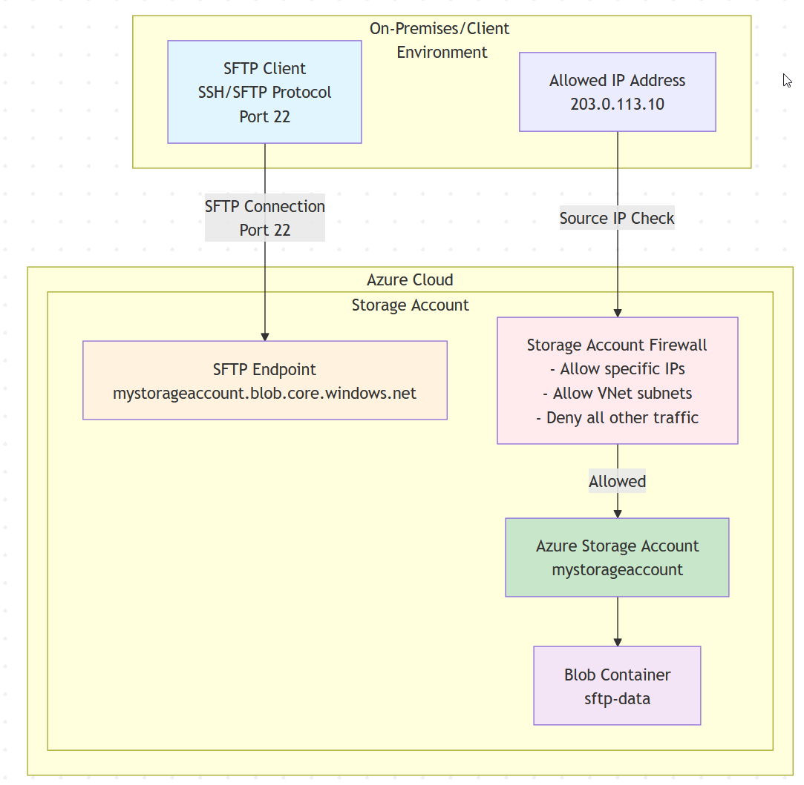
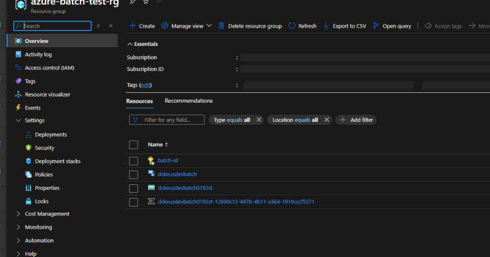

Hey Folks

It's being couple of months that I blogged about a solution. This time it's all you need to know about dealing with Azure Front doors with APEX domains. First let's start with a little bit of a introduction.

## What is an APEX domain

An APEX domain, in the context of domain name systems (DNS), refers to a root domain that doesn't have any subdomains. It's the top-level domain in a DNS hierarchy. For example, in the domain name "[example.com](https://example.com/)", "example" is the APEX domain, and "com" is the top-level domain (TLD).

## What is the fuss about using APEX domains with Azure Front Door

Problem here is Azure Front Door uses CNAME values to route traffic between the custom domain and its endpoints as an example. If you need to use a custom domain in front door like "abc.com"

you need to have a CNAME record like  
**abc.com ------> afdverify.contoso-frontend.azurefd.net**

Front door does not support A records

[](https://hungryboysl.wordpress.com/wp-content/uploads/2024/05/image.png)

But in general, you cannot have a CNAME record to an APEX domain here is why

A CNAME record is a type of DNS record that maps an alias to a canonical name. It's often used to direct traffic from one domain name to another. However, there are some restrictions on how CNAME records can be used, and one of those restrictions is that they cannot be used for APEX domains.

The reason for this is that CNAME records are designed to map a single domain name to another domain name. However, an APEX domain is the root domain in a DNS hierarchy, and it can't be mapped to another domain name using a CNAME record. Instead, APEX domains typically use other types of DNS records, such as A records or AAAA records, to map the domain name to an IP address.

https://www.isc.org/blogs/cname-at-the-apex-of-a-zone

**But some of the major DNS providers (Cloudflare, DNSimple, Azure DNS, etc..) does support a feature called CNAME flattening**. If your DNS provider support CNAME flattening, you will be able to getaway with this. However,

But Some of them does not support this at all like GODADDY

Even according to Azure Front door documentation, you need to have a DNS provider who supports CNAME flattening to use Azure Front Door Services

https://learn.microsoft.com/en-us/azure/frontdoor/apex-domain#dns-cname-flattening.

## What if your DNS provider does not support CNAME flattening...?

Then you are left with few options.

1. You need to move your DNS records to a supported DNS provider

3. You need to consider using a subdomain for your workload instead of the APEX domain

5. Use a different solution like Azure Application Gateway, which can be costly and with other limitations

7. **Or leveraging redirections**

Here is what I came up with

Solution is to leverage redirections with the APEX Domains. I created a separate web app that can redirect any traffic receives to it to www. domains

Here is what is going to happen

1. www.customdomain.com will be added to the Azure Fron Door and Pointed towards front door

3. APEX Domain "customdomain.com" will be pointed to the redirect web app using its IP address.

5. Adding the APEX domain "customdomain.com" will be added to the redirect web app and bind it using azure app service managed certificate.

Once above has been setup, if a traffic come to the APEX domain, Traffic will then get redirected to the www domain, which will then go thru Azure Front door and go the backend main app service.

As below.

[](https://hungryboysl.wordpress.com/wp-content/uploads/2024/05/image-1.png)

Here are the configurations for the redirect web app.

I just created a **web.config** file and added the following configurations details

```
 <?xml version="1.0" encoding="UTF-8"?>
<configuration>
  <system.webServer>
    <rewrite>
       <rules>
        <rule name="Allow the CORS Preflight" stopProcessing="true">
          <match url=".*" />
          <conditions>
            <add input="{REQUEST_METHOD}" pattern="^OPTIONS$" />
          </conditions>
          <action type="CustomResponse" statusCode="200" statusReason="Preflight" statusDescription="Preflight" />
        </rule>
        <rule name="Redirect Mobile Service" enabled="true" stopProcessing="true">
          <match url="(.*)" ignoreCase="true" />
          <conditions>
            <add input="{HTTP_HOST}" pattern=".*" />
          </conditions>
          <action type="Redirect" url="https://www.{HTTP_HOST}/{R:0}" redirectType="Permanent" appendQueryString="true" />
        </rule>
      </rules>
    </rewrite>
  </system.webServer>
</configuration>
```

There are some pros and cons to this solution, but I think Pros are outweigh the cons the cons depending on the scenario

**Pros**

1. You will be able to leverage your APEX domains without changing your DNS provider

3. Domain certificates will be automatically renewed at both end

5. Can host both app services in the same app service plan

7. Etc

**Cons**

1. Have to maintain the redirect webapp too

3. Little bit complex environment

Hope this will help some on in need, Please comment or reach out to me if you have any questions.

Untill next time....!
