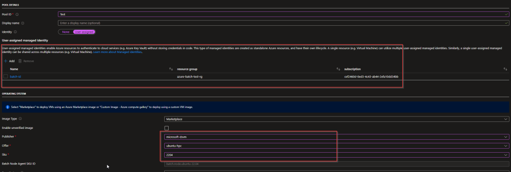
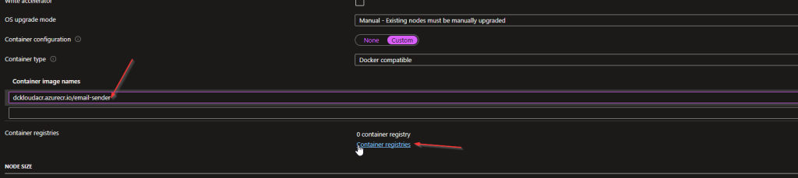
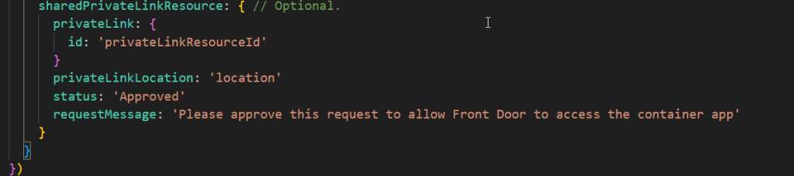

Its been a while, I wrote something, there were few reasons for it. But somehow, I'm back :). Today I wanted to talk about Azure Deployment Stacks. For some time, I was keeping tabs on Azure deployment stacks, seems like a pretty interesting feature for Resource manager deployments, this is somewhat more align to cloud formation templates.

For us to get started with this, lets look at what deployment stacks are. According to MS  
"An Azure deployment stack is a resource that enables you to manage a group of Azure resources as a single, cohesive unit. When you submit a Bicep file or an ARM JSON template to a deployment stack, it defines the resources that the stack manages"

Sounds interesting isn't it :D.

For me what makes more interesting are these facts

1. Update a deployment as well as REMOVE resources.

3. Kinda helps to set up the dependency with resources

Also, it talks about deny settings, I argue with myself and try to understand the use for it, since we can simply use a resource lock, and also at the moment deny settings does not apply to the resource group, so you are better off using the resource locks at this stage anyway.

Stacks going to be best, if you wanna deploy temp resources where you wanna clean up later down the line, or if you are creating multiple environments for testing like scenes and cleanup later down the line, I get asked by many people, is there a way to delete resources when using bicep. My answer to them was look in to deployment stacks. Since bicep itself can update the settings/configurations but cannot delete the resources.

Lets see what deployments stacks do, and how we can practically use it.

For me to test the deployment stacks I created a simple bicep file which deploys a resource group and two storage accounts. For now lets assume this is a complete application workload deployment

[](https://hungryboysl.wordpress.com/wp-content/uploads/2025/01/image-1.png)

```
One thing to note is that I have a Boolean value parameter that I use to define where to deploy resources or not
Also I create two bicep param files for this bicep file
prod.bicepparam and qa.bicepparam
```

Only differentiating factor in these two files are the "env" value

[](https://hungryboysl.wordpress.com/wp-content/uploads/2025/01/image-3.png)

Lets do a deployment using below code for both param files

[](https://hungryboysl.wordpress.com/wp-content/uploads/2025/01/image-4.png)

By the way below are the parameter explanation for the az stack cli commands

| Parameter | Description |
| --- | --- |
| `-Name` | Specifies the name of the deployment stack. |
| `-Location` | Specifies the Azure region where the deployment stack will be created. This is valid for Subscription based Deployment Stacks. |
| `-TemplateFile` | Specifies the Bicep file that defines the resources to be managed by the deployment stack. |
| `-DeploymentResourceGroupName` | Specifies the name of the resource group where the managed resources will be stored. |
| `-DenySettingsMode` | Specifies the operations that are prohibited on the managed resources to safeguard against unauthorized deletion or updates. Possible values include "none", "DenyDelete", "DenyWriteAndDelete". |
| `-DeleteResources` | Deletes the managed resources associated with the deployment stack. |
| `-DeleteAll` | Deletes all deployment stacks and their associated resources. |
| `-DeleteResourceGroups` | Deletes the resource groups associated with the deployment stacks. |

Because I'm doing a subscription scope deployment, I can go to the subscription and select deployment stacks to see the status as below

[](https://hungryboysl.wordpress.com/wp-content/uploads/2025/01/image-5.png)

Once completed I could see all the resources got deployed as part of the stack. And also using the GUI I get to edit and redeploy the template or parameter files. Important thing to note is the value that I specified for --action-on-unmanage, Also I would continue to use `-DenySettingsMode` to none, untill all the known issues and limitations get fixed.

[](https://hungryboysl.wordpress.com/wp-content/uploads/2025/01/image-6.png)

Now that I have both environments deployed. as per below, And I can confirm I can see all the resource that are properly deployed without an error. And I want to get rid of the resource deployed for the QA environment.

[](https://hungryboysl.wordpress.com/wp-content/uploads/2025/01/image-7.png)

What I would need to do is simply change the bicep param "isDeploy" to false and run another stack deployment for QA

[](https://hungryboysl.wordpress.com/wp-content/uploads/2025/01/image-8.png)

Let's see what's going to happen. Important to note that I use cli, so the deployment command is the same, but if you are deploying via PowerShell, you need to run the update command to update and existing stack, I will like the Microsoft reference document down below.

[](https://hungryboysl.wordpress.com/wp-content/uploads/2025/01/image-9.png)

Okay now lets look what happened, because we excluded the storage accounts inside the template, and also action on unmanage we said deleteall, it basically removed the storage account as we wanted. :D. But if you said action-on-unmanage to detach all it will simply detach resources from the stack and will not delete it.

[](https://hungryboysl.wordpress.com/wp-content/uploads/2025/01/image-10.png)

## **Conclusion**

Reflecting on some of the early concepts and designs for deployment stacks, I must say I’m so impressed with how far the deployment stacks has come!  
Like I said earlier the main thing for me is that they enable powerful scenarios, such as the ability to remove resources from a deployment that span across multiple resource groups, subscriptions, and management groups—offering functionality similar to the "destroy" option in tools like Terraform.

### Links

Learn doc - [https://learn.microsoft.com/en-us/azure/azure-resource-manager/bicep/deployment-stacks?tabs=azure-powershell?WT.mc\_id=AZ-MVP-5005246](https://learn.microsoft.com/en-us/azure/azure-resource-manager/bicep/deployment-stacks?tabs=azure-powershell?WT.mc_id=AZ-MVP-5005246)o
