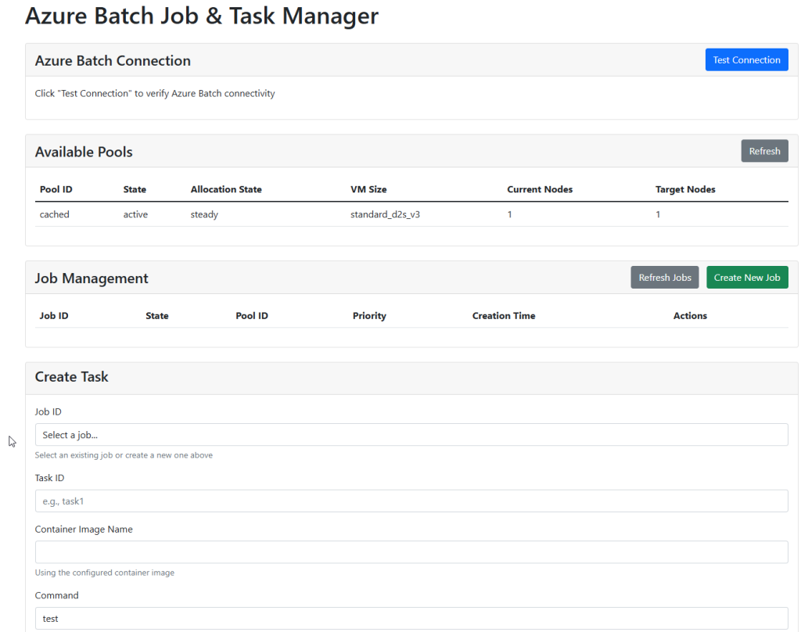
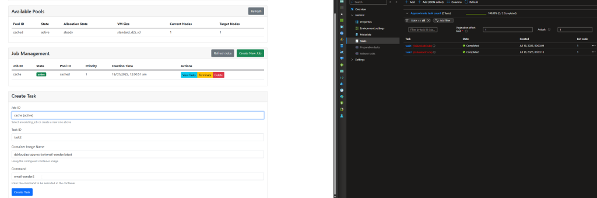
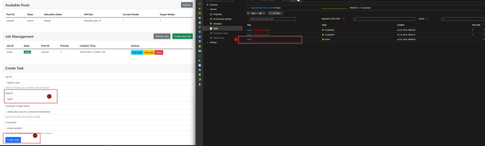
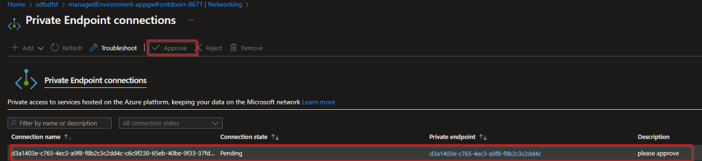
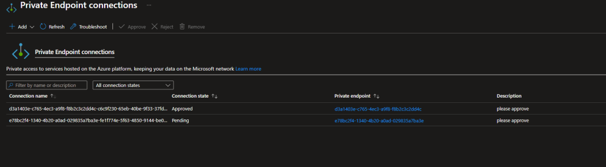
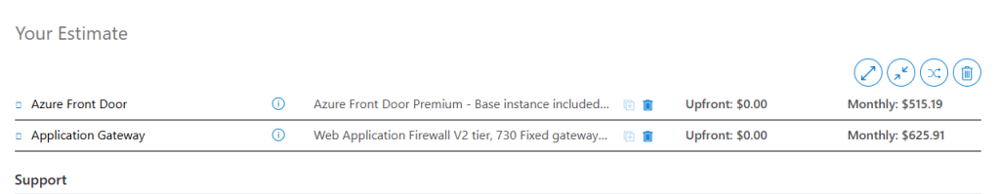
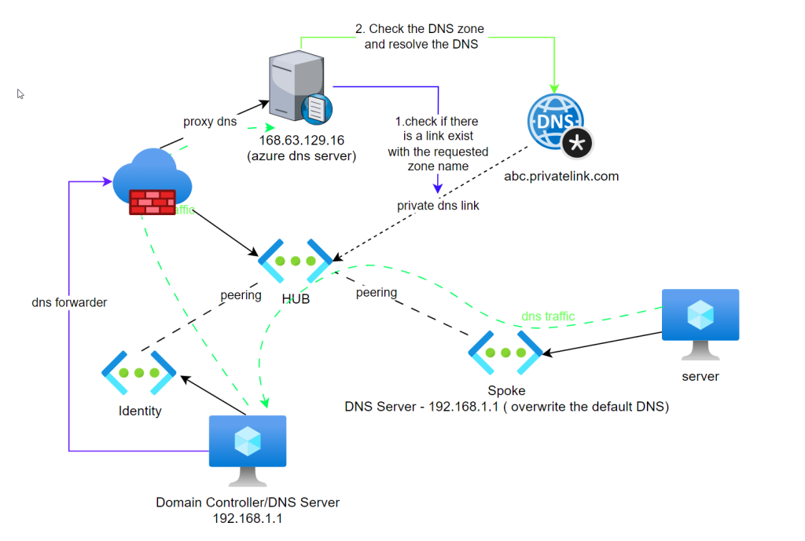
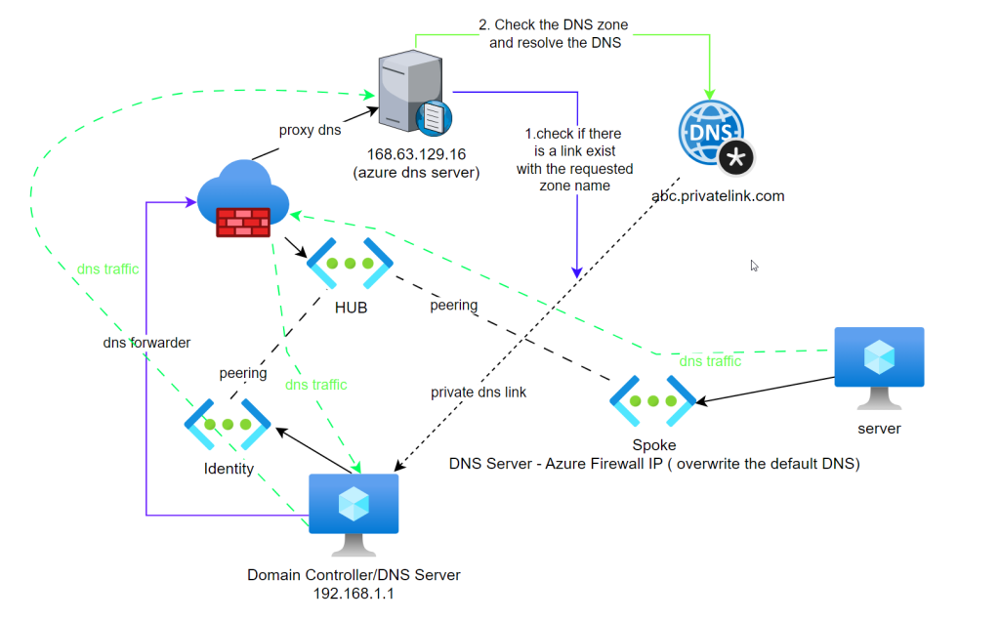

Howdy Folks

This time I want to talk about Azure DNS and Name resolutions happening in Azure. I regularly have discussions with IT professionals about this topic. And I agree sometimes it's so confusing. Let's dive in.  
In this blog I will conver scenarios with Azure firewall and domain controllers. I will come to you with the part two on this blog with other scenarios.

Before we get into details. We need to understand following key things.

## **Azure DNS Server -**

1. The Azure DNS Virtual Server IP address is 168.63.129.16

3. This address can only be reached within Azure environment.

5. By default, all the virtual networks/Services are pointed to this server for Primary DNS resolution.

7. This server can resolve DNS records again private DNS zones in your environment

9. Azure DNS server can resolve any public DNS record

## **Private DNS Zones -**

1. Azure Private DNS provides a reliable, secure DNS service to manage and resolve domain names in a virtual network without the need to add a custom DNS solution.

3. Private DNS zones linked to a VNet are queried first when using the default DNS settings of a VNet.

Example - If

1. there is private DNS zone called "abc.privatelink.com" in your tenant.

3. you have a VNET connected to this private DNS zone.

5. you have a virtual machine provisioned that the above mentioned vnet and primary dns is set to 168.63.129.16

7. You can resolve the DNS

### IF everything above aligns

###   
**IF the DNS does not exist, DNS resolutions will fail**

### **If it's not pointing to the Microsoft DNS server in someway**

## **Private DNS Resolver** -

1. You can use DNS Private Resolver for on-premises workloads and Azure workloads. DNS Private Resolver simplifies private DNS resolution from on-premises to the Azure private DNS service and vice versa.

3. **You need** private DNS resolver in two scenarios mainly
    - If have on prem resources needed to resolve against private DNS zones, if you don't have a cloud domain controller/ cloud DNS server
    
    - Complex environment with crazy domain setup and resolution pattern, I have seen this may be 3 times in my IT career :D

below link outlines almost all the DNS resolution scenarios with private DNS resolver.

[https://learn.microsoft.com/en-us/azure/architecture/networking/architecture/azure-dns-private-resolver](https://learn.microsoft.com/en-us/azure/architecture/networking/architecture/azure-dns-private-resolver)

Having said all above, lets dive into DNS resolution scenarios

## Scene 1 - Simple setup

This setup is simple and simply have a VNET link created and pointed to the Azure DNS

## Scene 2 - Domain Controller/DNS server in a another vnet (HUB and Spoke Architecture)

1. In this scenario, there is a domain controller/DNS server in the hub

3. DNS forwarder is created in the domain controller/DNS Server pointing to 168 addresses

5. HUB and Spoke is peered

7. Spoke networks DNS server is set as the domain controller

9. When the spoke server trying to resolve against the private DNS zone
    - it sends the query to domain controller
    
    - dc sends it to the azure DNS server
    
    - since there is a link between hub where the domain controller is with the private DNS zone
    
    - azure dns server resolves the query against the pdns zone and send the value back using the same path

NOTE :

1. Spoke server does not have a direct link with the DNS zone. **ITS NOT REQUIRED**

2\. Below scenario DNS resolution fails because there is no connection between hub and the dns zone. It DOESNT matter there is a connection between spoke and the zone, because domain controller is the point of contact between Azure DNS Server.

## Scene 3 - Domain Controller/DNS server in a another vnet with Azure Firewall (HUB and Spoke Architecture)

1. In this scenario, there is a domain controller/DNS server in the identity vnet

3. Azure Firewall is deployed into HUB, Azure firewall provide DNS Proxy feature when talking Azure DNS server

5. DNS forwarder is created in the domain controller/DNS Server pointing to Azure Firewall

7. HUB and Spokes are peered

9. Spoke networks DNS server is set as the domain controller

11. When the spok
    - it sends the query to domain controller
    
    - dc sends it to the Azure firewall
    
    - Azure firewall proxies the dns query and send it to Azure DNS
    
    - since there is a link between hub where the Azure firewall is with the private DNS zone
    
    - azure dns server resolves the query against the pdns zone and send the value back using the same path

## Scene 4 - Domain Controller/DNS server in a another vnet with Azure Firewall (HUB and Spoke Architecture)

1. In this scenario, there is a domain controller/DNS server in the identity vnet

3. Azure Firewall is deployed into HUB, Azure firewall is talking Domain controller

5. DNS forwarder is created in the domain controller/DNS Server pointing to Azure DNS server

7. HUB and Spokes are peered

9. Spoke networks DNS server is set as the domain controller

11. When the spok
    - it sends the query to azure firewall
    
    - azure firewall sends it to the Azure DNS server
    
    - Azure firewall proxies the dns query and send it to Azure DNS
    
    - since there is a link between identity vnet where the domain controller is with the private DNS zone
    
    - azure dns server resolves the query against the pdns zone and send the value back using the same path

## CONCLUSION

1. 168 IP can be only reached from Azure Environments

3. To resolve against Private DNS Zone
    - Private Vnet Link should exist with Vnet where the point of contact with the Azure DNS Server
    
    - Vnet should be connecting to Azure DNS server some how

5. Scene 3 can be achieved with DNS proxy when you have Azure Firewall Premium

7. Scene 4 comes into picture when you want to reduce the load against domain controllers.

9. I personally recommend option 3 if you have domain controllers and Azure firewall. which is pretty seemsless

Hope this help anyone in need of this information. Come to you soon with the part 2 of this.
