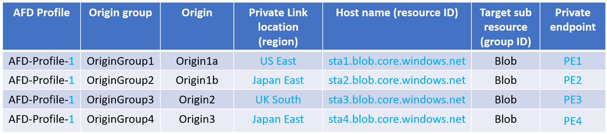
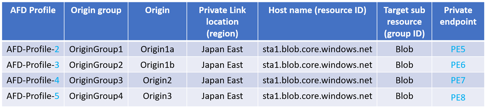

Howdy Folks,

This time I'm here to talk about container apps and my favourite WAF Azure Front door :). As part of the build updates, among all the AI features Microsoft released this update

Before we dive into what is possible now, let's look at what was possible with Container Apps

**_Option 1_**

Using an Application Gateway with the container App in your virtual network within the same region.

**_Drawbacks_**

- Cost to maintain an application gateway is high. You would need to run minimum of 2 instances for load balancing and resiliency that would bring your cost close 700AUD.

- If you are multi region then you would need Application gateway ideally in multiple regions for latency and network isolations, that mean you would need extra instances and global load balancers to manage the situation

**Option 2**

Provision an internal azure load balancer in front of container app and create a private link connection with the load balancer from front door.

> **_Drawbacks_**
> 
> - Operational overhead with this solution is much higher as you have to maintain an unnecessary resource just to enable the private connection
> 
> - Extra cost and if its multi region then it add more complexity
> 
> **Option 3**
> 
> Provision azure front door service but traffic between front door and container apps will be public, and leverage the whitelist frontdoor.backend ip ranges
> 
> 
> 
> **_Drawbacks_**
> 
> - This brings security concern to the architecture as we are only using ip whitelisting at the container level
> 
> - And only option we have hre is allow all the backend frondoor ip addresses. This means we allow traffic for other azure front door services outside of our network to access our container app

Lets look at the cost difference between Azure Application gateway and Azure Front Door, Keep in mind Azure Front Door is a Global Service, MS manage everything for us when it comes to instances and HA

**_Solution_**

> Like I said above, exposing your Container Apps securely meant one of two trade‑offs:
> 
> - **Extra application‑layer verifications** (e.g. custom IP allow‑lists or OAuth guards)
> 
> - **Whitelisting Azure Front Door’s full range of backend IPs** (a moving target)
> 
> Or you’d spin up an Application Gateway just to keep your app private—adding cost and comple
> 
> **You can now configure Azure Container Apps and Azure Functions as Private Link enabled origins in your Front Door Premium profile. Private Link enabled origins in Front Door allow you to deliver content to your end-users through public Front Door endpoints while ensuring that your origins remain inaccessible to the public internet.** 
> 
> [https://azure.microsoft.com/en-us/updates?id=494357](https://azure.microsoft.com/en-us/updates?id=494357)

here is how you do, as always, I'm going to use Azure Bicep for the deployment. If you want to see the full code, please head out to my GitHub page linked below

Couple of things to highlight in the code -

To enable private links with container apps. In the container app environment side, you would need to disable the public inbound access which you can do with this value

In Gui following is the setting

And on the front door origin configuration side you would need to enable you would need to pass the following values

In Gui you are the following setting when configuring the origin

here is the link to the relevant Microsoft documentation

[https://learn.microsoft.com/en-us/azure/templates/microsoft.cdn/profiles/origingroups/origins?pivots=deployment-language-bicep#sharedprivatelinkresourceproperties](https://learn.microsoft.com/en-us/azure/templates/microsoft.cdn/profiles/origingroups/origins?pivots=deployment-language-bicep#sharedprivatelinkresourceproperties)

Once the deployment is completed. You would need to go the container app and accept the private endpoint connection

Sometimes you will see multiple private endpoints are getting created within the same description or request msg like below

Not to worry MS explains why

#### Multiple private endpoints

A new private endpoint gets created in the following scenario:

- If the region, resource ID or group ID changes, AFD considers that the Private Link location and the hostname has changed, resulting in extra private endpoints created and each one needs to be approved.

- Enabling Private Link for origins in different Front Door profiles will create extra private endpoints and requires approval for each one.

[https://learn.microsoft.com/en-us/azure/frontdoor/private-link#multiple-private-endpoints](https://learn.microsoft.com/en-us/azure/frontdoor/private-link#multiple-private-endpoints)

### Conclusion

With this new update, Microsoft has significantly simplified how we can securely expose Azure Container Apps using Azure Front Door. No more juggling Application Gateways, internal load balancers, or relying solely on IP whitelisting. Now, you get the best of both worlds — a globally distributed, high-performance edge with Azure Front Door _and_ secure, private access to your container apps via Private Link.

This unlocks a powerful, cost-effective architecture pattern that's simpler to manage and more secure by design.

If you're modernizing your apps or designing for multi-region, this is a game changer. Give it a try — and as always, feel free to explore my [GitHub repo](https://github.com/azurewithdanidu/azure-frontdoor-private-endpoints-for-container-apps) for the full Bicep code and reach out if you have any questions
