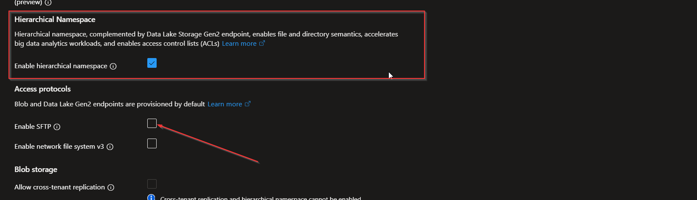

---

title: "Running And Securing FTP Service in Azure"  
date: 2025-10-14  
categories:

*   "azure"
*   "azure-infrastructure"
*   "ftp"
*   "security"
*   'storage'  
    tags:
*   "bicep"
*   "compute"
*   "infrastructure"
*   "networking"
*   "security"
*   "storage"

---

Howdy Folks,

In this post, we will explore how to set up and secure an FTP service in Microsoft Azure. FTP (File Transfer Protocol) is a standard network protocol used for transferring files between a client and server. While FTP is widely used, it is important to implement security measures to protect data during transfer. Mostly we talk about hosting app services, databases, and other cloud-native solutions, but sometimes you need to run legacy services like FTP. In this guide, we will cover the necessary steps to deploy an FTP service in Azure using Azure Blob Storage for file storage, and we will implement security best practices to ensure safe file transfers.

Let's get started!

First lets talk about few possible architectures for running FTP in Azure using Storage Accounts:  
Architectures depends on your requirements and your current environment and budget. Here are a few common architectures:

1.  **SFTP Enabled Storage Account with Storage Account Firewall**:
    *   Use Azure Blob Storage with SFTP enabled for secure file transfers.
    *   Configure the Storage Account firewall to restrict access to specific IP addresses or virtual networks.
    *   This is the simplest and most cost-effective solution for secure file transfers.



1.  **SFTP Enabled Storage Account with Azure Firewall configuration**:
    *   Use Azure Blob Storage with SFTP enabled for secure file transfers.
    *   Configure Azure Firewall to restrict access to the Storage Account based on IP addresses or virtual networks.
    *   This solution provides an additional layer of security by leveraging Azure Firewall capabilities.
    *   This will be a bit more expensive than the first option.
    *   Also this will provide more visibility and control over the traffic.


Okay lets dive into the steps to set up and secure an FTP service in Azure using the first architecture option:

### Step 1: Create an Azure Storage Account with SFTP Enabled
When you are creating a new storage account make sure to enable Hierarchical namespace, only then you can use the SFTP feature in storage accounts


### Step 2: Configure SFTP on the Storage Account
1. Navigate to the Storage Account in the Azure portal.
2. Under Setting you will find the SFTP option, click on it.

3. Enable SFTP and configure the required settings, such as authentication methods (SSH keys or password).
4. Create local users for SFTP access and assign appropriate permissions to the Blob containers.
Note at the moment you can only create local users, you cannot use Azure AD users for SFTP access.

As you can see when creating a local user you can select the authentication type, either SSH or password. You can also assign permissions to specific containers in the storage account.

You can find more details about configuring the SFTP feature in the official documentation [here](https://learn.microsoft.com/en-us/azure/storage/blobs/secure-file-transfer-protocol-support?tabs=azure-portal).

But the most important part is to secure the storage account, so lets move to the next step.
### Step 3: Secure the Storage Account
1. Navigate to the Storage Account in the Azure portal.
2. Under Security + networking, select Networking. --> click manage public network access and allow traffic from selected networks.
3. Configure the firewall settings to restrict access to the Storage Account from specific IP addresses or virtual

This is where you limit the access to the storage account from specific networks. Specifically, if its outside of your network you can whitlist the IP addresses that can access the storage account.


Now lets see how much secure this is or visibility we have into the traffic.
Pros
1. This option provided basic level of layer 3 and layer 4 security, you can restrict access to the storage account based on IP addresses and virtual networks.
2. This is fairly simple and cost effective to setup 
3. You can enable diagnostic settings to log and monitor access to the storage account but you could only track the following operations: Storage Read, Storage Write, Storage Delete, and Transaction.
4. You can possibly enable defender for storage accounts to get threat protection for your storage account.

Cons
1. You cannot inspect the traffic, you can only restrict access based on IP addresses and virtual networks.
2. This option cannot centralize the entry point for your traffic or force traffic inspection etc.
3. You can only use local users for SFTP access, you cannot use Azure AD users or managed identities.:(


Also if you want set everything up using infrastructure as code, here is a sample Bicep code to create a storage account with SFTP enabled and firewall rules configured:

```bicep
@description('The name of the storage account')
param storageAccountName string = 'stsftp${uniqueString(resourceGroup().id)}'

@description('The location for all resources')
param location string = resourceGroup().location

@description('The environment name (dev, staging, prod)')
param environment string = 'dev'

@description('Allowed IP addresses for storage account firewall')
param allowedIpAddresses array = []

@description('SFTP local user configurations')
param sftpUsers array = [
  {
    name: 'sftpuser1'
    homeDirectory: 'uploads'
    permissionScopes: [
      {
        permissions: 'rcwdl'
        service: 'blob'
        resourceName: 'uploads'
      }
    ]
    hasSharedKey: false
    hasSshKey: true
    hasSshPassword: false
  }
]

// Deploy Storage Account using AVM module
module storageAccount 'br/public:avm/res/storage/storage-account:0.9.1' = {
  name: 'storageAccountDeployment'
  params: {
    name: storageAccountName
    location: location
    skuName: 'Standard_LRS'
    kind: 'StorageV2'
    
    // Enable hierarchical namespace for SFTP
    isHnsEnabled: true
    
    // Enable SFTP
    isSftpEnabled: true
    
    // Local users for SFTP
    localUsers: sftpUsers
    
    // Network access configuration
    networkAcls: {
      defaultAction: 'Deny'
      bypass: 'AzureServices'
      ipRules: [for ip in allowedIpAddresses: {
        value: ip
        action: 'Allow'
      }]
    }
    
    // Enable blob public access
    allowBlobPublicAccess: false
    
    // Security settings
    minimumTlsVersion: 'TLS1_2'
    supportsHttpsTrafficOnly: true
    
    // Diagnostic settings
    diagnosticSettings: [
      {
        name: 'storageAccountDiagnostics'
        workspaceResourceId: '/subscriptions/${subscription().subscriptionId}/resourceGroups/${resourceGroup().name}/providers/Microsoft.OperationalInsights/workspaces/law-${environment}-${location}'
        logCategoriesAndGroups: [
          {
            categoryGroup: 'allLogs'
            enabled: true
          }
        ]
        metricCategories: [
          {
            category: 'Transaction'
            enabled: true
          }
        ]
      }
    ]
    
    // Tags
    tags: {
      Environment: environment
      Purpose: 'SFTP File Transfer'
      CreatedBy: 'Bicep-AVM'
    }
  }
}

// Create blob container for uploads
module blobContainer 'br/public:avm/res/storage/storage-account/blob-service/container:0.2.1' = {
  name: 'uploadsContainerDeployment'
  params: {
    storageAccountName: storageAccount.outputs.name
    name: 'uploads'
    publicAccess: 'None'
  }
  dependsOn: [
    storageAccount
  ]
}

// Output important information
output storageAccountName string = storageAccount.outputs.name
output sftpEndpoint string = storageAccount.outputs.primaryEndpoints.dfs
output storageAccountId string = storageAccount.outputs.resourceId
output sftpHostname string = '${storageAccountName}.blob.core.windows.net'

```


This Bicep code creates an Azure Storage Account with SFTP enabled, configures local users for SFTP access, and sets up firewall rules to restrict access based on specified IP addresses. It also creates a Blob container for file uploads.


Okay now lets look at our slightly complex architecture using Azure Firewall to secure the storage account. This will be in the next blog post. Stay tuned! 