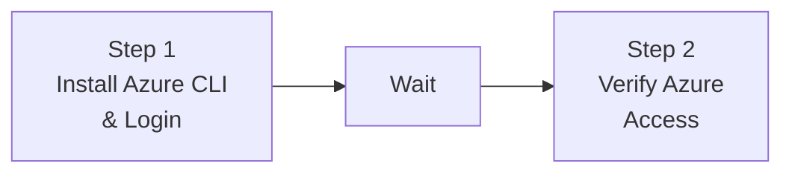
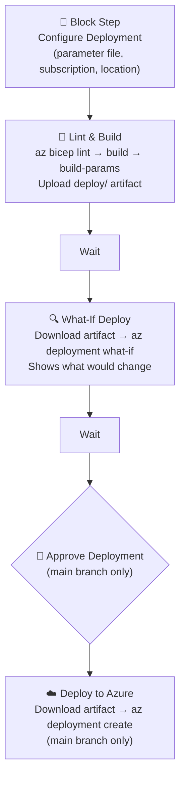

Howdy Folks,

It's been some time since I last delved into CI/CD tooling outside the usual suspects — Azure DevOps Pipelines and GitHub Actions. But recently, I had a scenario that pushed me towards **Buildkite**, and I have to say, the experience was genuinely refreshing.

Here's the situation: I had existing GitHub Actions workflows deploying Azure Landing Zones with Bicep. They worked great. But what if you need your CI/CD agent to run on your _own_ infrastructure — inside a private network, behind a firewall, on a machine you fully control? GitHub-hosted runners can't always reach those private endpoints, and self-hosted GitHub Actions runners come with their own quirks. Buildkite is purpose-built for exactly this pattern.

In this post, I'll walk you through two production-ready Buildkite pipelines I built for Azure:

1. **Pipeline 1** — Azure CLI Login (the foundation)
2. **Pipeline 2** — Full Bicep Template Deployment (lint → build → what-if → approve → deploy)

All the code is open-source and available in my GitHub repository. So let's cut to the chase.

---

## What is Buildkite and Why Should You Care?

**Buildkite** is a CI/CD platform that splits responsibilities in a way that's fundamentally different from fully hosted platforms:

- **Buildkite SaaS** — orchestrates builds, stores pipeline definitions, and shows build results in the web UI
- **Buildkite Agent** — a small process _you_ run on your own machines (VMs, containers, laptops) that picks up and executes jobs

This means your code, credentials, and sensitive data **never leave your environment**. For Azure deployments that need access to private VNets, on-premises resources, or sensitive credentials, this is a genuine advantage.

> If you've ever fought with GitHub-hosted runners trying to reach private endpoints, you'll immediately appreciate why this architecture matters.
{: .prompt-info }

### Buildkite Free Tier

Buildkite has a generous free plan — no credit card required:

| Feature | Free Plan |
|---|---|
| Users | Up to 3 |
| Pipelines | Unlimited |
| Builds | Unlimited |
| Agents | Unlimited (self-hosted) |
| Build History | 90 days |
| Secrets | Included |
| Clusters | 1 |

The free plan doesn't include SSO, audit logs, or priority support. For teams larger than 3 or with enterprise compliance requirements, you'll need a [paid plan](https://buildkite.com/pricing).

---

## Design Principles — Scripts Over Inline YAML

Before I show you the pipelines, let me explain the design philosophy. This is important because it's what makes these pipelines maintainable and reusable.

**All logic lives in `.sh` files under `.buildkite/scripts/`.** The pipeline YAML only defines step order and calls scripts. This gives you:

- **No `$$` escaping** of bash variables inside YAML — if you've done this before, you know the pain
- **No heredocs** or multi-line string gymnastics
- **Local testing** — every script can be tested with `bash .buildkite/scripts/script-name.sh`
- **Reusability** — the Bicep scripts are driven entirely by environment variables. To deploy a different template, create a new pipeline YAML and change the env vars — no script changes needed

**Each step is self-contained.** Buildkite steps run in completely fresh environments — nothing installed or set in one step persists to the next. So every step that needs Azure CLI re-runs the install and login scripts. They're idempotent and complete quickly if the tool is already present.

---

## Repository Structure

Here's the full layout of the [azure-buildkite-pipelines](https://github.com/azurewithdanidu/azure-buildkite-pipelines) repository:

```
.
├── .buildkite/
│   ├── pipeline.yml                       # Pipeline 1: Azure CLI install + login
│   ├── pipeline-with-fallback.yml         # Pipeline 1 variant: env var fallback
│   ├── pipeline-bicep-landing-zone.yml    # Pipeline 2: Bicep lint, build, what-if, deploy
│   └── scripts/
│       ├── install-az.sh                  # Installs Azure CLI (shared, idempotent)
│       ├── az-login.sh                    # Authenticates via Buildkite Secrets
│       ├── az-login-with-fallback.sh      # Authenticates with env var fallback
│       ├── verify-access.sh               # Lists account and resource groups
│       ├── bicep-install.sh               # Installs Bicep CLI
│       ├── bicep-build.sh                 # Lints and compiles Bicep, outputs to deploy/
│       ├── bicep-whatif.sh                # What-if across all 4 deployment scopes
│       └── bicep-deploy.sh               # Deploy across all 4 deployment scopes
├── bicep/
│   └── main.bicep                         # Sample Bicep template
│   └── main.bicepparam                    # Sample Bicep parameter file
└── sample/
    ├── landing-zone.yml                   # Original GitHub Actions workflow (reference)
    ├── build-action.yml                   # Original build action (reference)
    └── deploy-action.yml                  # Original deploy action (reference)
```

The `sample/` folder contains the original GitHub Actions workflows these pipelines were converted from — useful for comparison if you're migrating from Actions to Buildkite.

---

## Authentication — Service Principal with Buildkite Secrets

These pipelines authenticate to Azure using a **service principal with a client secret**. Credentials are stored in [Buildkite Secrets](https://buildkite.com/docs/pipelines/security/secrets/buildkite-secrets), which are encrypted at rest and injected at runtime by the agent — they are never exposed in logs or pipeline YAML.

### Step 1 — Create a Service Principal in Azure

```bash
az ad sp create-for-rbac \
  --name "buildkite-agent" \
  --role Contributor \
  --scopes /subscriptions/{your-subscription-id}
```

The output will look like this:

```json
{
  "appId":       "xxxxxxxx-xxxx-xxxx-xxxx-xxxxxxxxxxxx",
  "password":    "xxxxxxxx-xxxx-xxxx-xxxx-xxxxxxxxxxxx",
  "tenant":      "xxxxxxxx-xxxx-xxxx-xxxx-xxxxxxxxxxxx"
}
```

Map these values to secrets:
- `appId` → `AZURE_CLIENT_ID`
- `password` → `AZURE_CLIENT_SECRET`
- `tenant` → `AZURE_TENANT_ID`

> For Bicep deployments at subscription scope that assign roles (e.g. landing zone patterns), the service principal also needs the **Owner** role, or at minimum **Contributor** plus **User Access Administrator**.
{: .prompt-warning }

### Step 2 — Store Credentials as Buildkite Secrets

1. In Buildkite, go to your pipeline
2. Click **Settings** → **Secrets**
3. Add each secret:

| Secret Name | Value |
|---|---|
| `AZURE_CLIENT_ID` | Service principal App ID |
| `AZURE_CLIENT_SECRET` | Service principal password |
| `AZURE_TENANT_ID` | Azure AD tenant ID |

At runtime, scripts retrieve these using:

```bash
AZURE_CLIENT_ID=$(buildkite-agent secret get AZURE_CLIENT_ID)
```

The agent fetches the value from the Buildkite API over a local socket — the secret is never written to disk or printed to stdout.

> Buildkite Secrets require agent **v3.27.0 or higher**. Check your version with `buildkite-agent --version`.
{: .prompt-info }

### A Note on OIDC

The original GitHub Actions workflows used **OpenID Connect (OIDC)** for passwordless authentication — no client secret stored anywhere; Azure trusts GitHub's identity token directly.

Buildkite also supports OIDC. However, getting Buildkite OIDC to work with Azure requires several non-trivial steps:

1. Creating an app registration with a federated identity credential pointing to Buildkite's OIDC issuer (`https://agent.buildkite.com`)
2. Configuring the correct subject claim matching the Buildkite organization slug, pipeline slug, and optionally the branch
3. Ensuring agent version and cluster configuration support OIDC token generation
4. The federated credential subject format is not well-documented for Buildkite specifically

Due to these complexities, these pipelines use service principal + client secret stored in Buildkite Secrets. This is a well-understood, reliable approach and is secure when combined with Buildkite Secrets (not hardcoded env vars). If you want to pursue OIDC in the future, refer to [Buildkite OIDC docs](https://buildkite.com/docs/agent/v3/cli-oidc) and [Azure Workload Identity Federation](https://learn.microsoft.com/azure/active-directory/workload-identities/workload-identity-federation).

---

## Pipeline 1 — Azure CLI Login

This is the foundation pipeline. It installs Azure CLI on the agent and authenticates with Azure using the service principal credentials stored in Buildkite Secrets.

### Pipeline Flow



Each step re-runs `install-az.sh` and `az-login.sh` because Buildkite steps run in completely isolated environments — nothing persists between them.

### The Pipeline YAML

```yaml
agents:
  queue: "default"

steps:
  - label: ":azure: Install Azure CLI & Login"
    key: "azure-setup"
    command:
      - "bash .buildkite/scripts/install-az.sh"
      - "bash .buildkite/scripts/az-login.sh"
    retry:
      automatic:
        - exit_status: "*"
          limit: 2
    timeout_in_minutes: 10

  - wait

  - label: ":white_check_mark: Verify Azure Access"
    key: "verify-access"
    command:
      - "bash .buildkite/scripts/install-az.sh"
      - "bash .buildkite/scripts/az-login.sh"
      - "bash .buildkite/scripts/verify-access.sh"
    soft_fail: true
    timeout_in_minutes: 5
```

Notice how clean the YAML is — no inline bash, no variable escaping, just script calls. The `retry` block gives the setup step two automatic retries (useful for transient network issues during CLI installation), and the verify step uses `soft_fail: true` so a listing failure won't block the pipeline.

### Key Scripts

**`install-az.sh`** — Detects the agent's OS and installs Azure CLI accordingly. Supports Debian/Ubuntu, RHEL/CentOS, and macOS. Skips installation if `az` is already present:

```bash
#!/bin/bash
set -euo pipefail

echo "--- :package: Installing Azure CLI"

if command -v az >/dev/null 2>&1; then
  echo "✅ Azure CLI already installed: $(az --version | head -1)"
  exit 0
fi

echo "Azure CLI not found, installing..."

if [ -x "$(command -v apt-get)" ]; then
  echo "Detected Debian/Ubuntu"
  # ... apt-get install azure-cli
elif [ -x "$(command -v yum)" ]; then
  echo "Detected RHEL/CentOS"
  # ... yum install azure-cli
elif [ -x "$(command -v brew)" ]; then
  echo "Detected macOS"
  brew update && brew install azure-cli
else
  echo "❌ Unsupported OS"
  exit 1
fi
```

**`az-login.sh`** — Fetches credentials from Buildkite Secrets, runs `az login --service-principal`, and creates a Buildkite build annotation showing the authenticated account:

```bash
#!/bin/bash
set -euo pipefail

echo "--- :key: Retrieving Azure credentials from Buildkite Secrets"

AZURE_CLIENT_ID=$(buildkite-agent secret get AZURE_CLIENT_ID)
AZURE_CLIENT_SECRET=$(buildkite-agent secret get AZURE_CLIENT_SECRET)
AZURE_TENANT_ID=$(buildkite-agent secret get AZURE_TENANT_ID)

echo "--- :azure: Logging in to Azure"

az login --service-principal \
  --username "${AZURE_CLIENT_ID}" \
  --password "${AZURE_CLIENT_SECRET}" \
  --tenant "${AZURE_TENANT_ID}" \
  --output none

echo "✅ Login successful"

ACCOUNT_NAME=$(az account show --query name -o tsv)
SUBSCRIPTION_ID=$(az account show --query id -o tsv)

echo "Account:         ${ACCOUNT_NAME}"
echo "Subscription ID: ${SUBSCRIPTION_ID}"
```

**`verify-access.sh`** — A simple verification that runs `az account show` and `az group list`, then annotates the build:

```bash
#!/bin/bash
set -euo pipefail

echo "--- :mag: Verifying Azure access"

echo "Current account:"
az account show --output table

echo ""
echo "Available resource groups:"
az group list --output table

RG_COUNT=$(az group list --query "length([])" --output tsv)

buildkite-agent annotate --style info --context azure-verify <<EOF
### :mag: Azure Access Verified

**Resource Groups Found:** ${RG_COUNT}

You can now use Azure CLI in subsequent pipeline steps.
EOF
```

### Pipeline Variants

| Pipeline | When to Use |
|---|---|
| `pipeline.yml` | Buildkite Secrets are configured. Fails immediately if any secret is missing. |
| `pipeline-with-fallback.yml` | Testing without secrets, or migrating from environment variables. Falls back to env vars if secrets are unavailable. |

---

## Pipeline 2 — Bicep Template Deployment

This is where it gets interesting. A full CI/CD pipeline for deploying Azure **Bicep** templates, converted from the GitHub Actions workflows in the `sample/` folder. It supports all four Azure deployment scopes: **subscription**, **tenant**, **management group**, and **resource group**.

### Pipeline Flow



### The Pipeline YAML

```yaml
env:
  BICEP_TEMPLATE_FILE_PATH: "bicep/main.bicep"
  BICEP_DEPLOYMENT_NAME: "deploy_bicep"
  AZURE_DEPLOYMENT_TYPE: "subscription"

steps:
  # Step 1: User selects deployment parameters
  - block: ":gear: Configure Deployment"
    prompt: "Select the deployment parameters for the landing zone"
    fields:
      - select: "Parameter File"
        key: "parameter_file_path"
        required: true
        options:
          - label: "Workload 1"
            value: "bicep/main.bicepparam"

      - select: "Target Subscription"
        key: "subscription_id"
        required: true
        options:
          - label: "sample-subscription-1"
            value: ""

      - select: "Location"
        key: "location"
        required: true
        default: "australiaeast"
        options:
          - label: "Australia East"
            value: "australiaeast"

  # Step 2: Lint & Build
  - label: ":bicep: Lint & Build"
    key: "build"
    command:
      - "bash .buildkite/scripts/install-az.sh"
      - "bash .buildkite/scripts/az-login.sh"
      - "bash .buildkite/scripts/bicep-install.sh"
      - "bash .buildkite/scripts/bicep-build.sh"
    artifact_paths:
      - "deploy/**"
    timeout_in_minutes: 15

  - wait

  # Step 3: What-If
  - label: ":mag: What-If Deploy"
    key: "whatif"
    command:
      - "bash .buildkite/scripts/install-az.sh"
      - "bash .buildkite/scripts/az-login.sh"
      - "bash .buildkite/scripts/bicep-install.sh"
      - "buildkite-agent artifact download 'deploy/**' ."
      - "bash .buildkite/scripts/bicep-whatif.sh"
    timeout_in_minutes: 15

  - wait

  # Step 4: Manual approval (main only)
  - block: ":rocket: Approve Deployment to Azure"
    prompt: "Review the What-If output above. Approve to deploy to Azure."
    if: build.branch == "main"

  # Step 5: Deploy (main only)
  - label: ":azure: Deploy to Azure"
    key: "deploy"
    command:
      - "bash .buildkite/scripts/install-az.sh"
      - "bash .buildkite/scripts/az-login.sh"
      - "bash .buildkite/scripts/bicep-install.sh"
      - "buildkite-agent artifact download 'deploy/**' ."
      - "bash .buildkite/scripts/bicep-deploy.sh"
    if: build.branch == "main"
    timeout_in_minutes: 30
    concurrency: 1
    concurrency_group: "bicep-landing-zone-deploy"
```

Let me break down the highlights:

- **Block step with selectable fields**: The first step prompts the user to select the parameter file, target subscription, and Azure region — equivalent to `workflow_dispatch` inputs in GitHub Actions. Values are stored as Buildkite meta-data and read by scripts.
- **Artifact passing**: The build step compiles Bicep to JSON and uploads the `deploy/` directory as a Buildkite artifact. Subsequent steps download it with `buildkite-agent artifact download`.
- **Branch-gated deployment**: The approval gate and deploy step only appear on the `main` branch (`if: build.branch == "main"`).
- **Concurrency control**: `concurrency: 1` and `concurrency_group` ensure only one deployment runs at a time — no accidental parallel deployments.

### The Bicep Scripts — Deep Dive

#### `bicep-build.sh` — Lint, Compile, and Package

This script does three things:
1. **Lints** the Bicep template with `az bicep lint`
2. **Compiles** `.bicep` to `.json` with `az bicep build`
3. **Converts** `.bicepparam` to `.parameters.json` with `az bicep build-params`

Everything outputs to a `deploy/` directory that gets uploaded as a build artifact.

```bash
#!/bin/bash
set -euo pipefail

BUILD_DIR="deploy"
BICEP_TEMPLATE_FILE_PATH="${BICEP_TEMPLATE_FILE_PATH:?BICEP_TEMPLATE_FILE_PATH env var is required}"

# Read parameter file path from env var or Buildkite meta-data
if [ -z "${BICEP_PARAMETER_FILE_PATH:-}" ]; then
  BICEP_PARAMETER_FILE_PATH="$(buildkite-agent meta-data get parameter_file_path 2>/dev/null || echo '')"
fi

mkdir -p "${BUILD_DIR}"

# Lint
echo "--- :mag: Linting Bicep template"
az bicep lint --file "${BICEP_TEMPLATE_FILE_PATH}"
echo "✅ Lint passed"

# Build template → JSON
echo "--- :hammer: Building Bicep template"
az bicep build --file "${BICEP_TEMPLATE_FILE_PATH}" --outdir "${BUILD_DIR}"

# Build / copy parameter file
if [[ "${BICEP_PARAMETER_FILE_PATH}" == *.bicepparam ]]; then
  PARAM_OUT="${BUILD_DIR}/$(basename "${BICEP_PARAMETER_FILE_PATH%.bicepparam}").parameters.json"
  az bicep build-params --file "${BICEP_PARAMETER_FILE_PATH}" --outfile "${PARAM_OUT}"
elif [[ "${BICEP_PARAMETER_FILE_PATH}" == *.json ]]; then
  cp "${BICEP_PARAMETER_FILE_PATH}" "${BUILD_DIR}/"
fi

echo "--- :white_check_mark: Build artifacts"
ls -la "${BUILD_DIR}/"
```

#### `bicep-whatif.sh` — Preview Changes Safely

The what-if script is where the multi-scope magic happens. It reads `AZURE_DEPLOYMENT_TYPE` and routes to the correct `az deployment` scope:

```bash
case "${AZURE_DEPLOYMENT_TYPE}" in
  subscription)
    az account set --subscription "${AZURE_SUBSCRIPTION_ID}"
    az deployment sub what-if \
      --name     "${BICEP_DEPLOYMENT_NAME}" \
      --location "${AZURE_LOCATION}" \
      --subscription "${AZURE_SUBSCRIPTION_ID}" \
      --template-file "${TEMPLATE_JSON}" \
      "${PARAM_ARG[@]+"${PARAM_ARG[@]}"}"
    ;;
  tenant)
    az deployment tenant what-if \
      --name     "${BICEP_DEPLOYMENT_NAME}" \
      --location "${AZURE_LOCATION}" \
      --template-file "${TEMPLATE_JSON}" \
      "${PARAM_ARG[@]+"${PARAM_ARG[@]}"}"
    ;;
  managementgroup)
    az deployment mg what-if \
      --name               "${BICEP_DEPLOYMENT_NAME}" \
      --location           "${AZURE_LOCATION}" \
      --management-group-id "${AZURE_MANAGEMENT_GROUP_ID}" \
      --template-file      "${TEMPLATE_JSON}" \
      "${PARAM_ARG[@]+"${PARAM_ARG[@]}"}"
    ;;
  resourcegroup)
    az account set --subscription "${AZURE_SUBSCRIPTION_ID}"
    az deployment group what-if \
      --name           "${BICEP_DEPLOYMENT_NAME}" \
      --resource-group "${AZURE_RESOURCE_GROUP_NAME}" \
      --template-file  "${TEMPLATE_JSON}" \
      "${PARAM_ARG[@]+"${PARAM_ARG[@]}"}"
    ;;
esac
```

The same pattern is used in `bicep-deploy.sh` with `what-if` replaced by `create`.

### Deployment Scopes

The pipeline supports all four Azure ARM deployment scopes out of the box:

| Scope | `AZURE_DEPLOYMENT_TYPE` | Additional Env Vars Required |
|---|---|---|
| Subscription | `subscription` | `AZURE_SUBSCRIPTION_ID` |
| Tenant | `tenant` | — (requires tenant-level RBAC) |
| Management Group | `managementgroup` | `AZURE_MANAGEMENT_GROUP_ID` |
| Resource Group | `resourcegroup` | `AZURE_SUBSCRIPTION_ID`, `AZURE_RESOURCE_GROUP_NAME` |

Switch scopes by changing the `env` block in your pipeline YAML:

```yaml
env:
  AZURE_DEPLOYMENT_TYPE: "managementgroup"
  AZURE_MANAGEMENT_GROUP_ID: "your-mg-id"
```

The scripts are completely reusable — no changes needed.

---

## Getting Started — Step by Step

### 1. Create a Buildkite Account

Sign up at [buildkite.com](https://buildkite.com/). The free plan requires no credit card.

### 2. Install the Buildkite Agent

The agent runs on your own machine and executes pipeline jobs. Install it on any Linux, macOS, or Windows machine that has network access to Azure.

**Linux (Debian/Ubuntu):**

```bash
echo "deb https://apt.buildkite.com/buildkite-agent stable main" \
  | sudo tee /etc/apt/sources.list.d/buildkite-agent.list
curl -fsSL https://keys.openpgp.org/vks/v1/by-fingerprint/32A37959C2FA5C3C99EFBC32A79206696452D198 \
  | sudo gpg --dearmor -o /etc/apt/keyrings/buildkite-agent-archive-keyring.gpg
sudo apt-get update && sudo apt-get install -y buildkite-agent
```

**macOS:**

```bash
brew install buildkite/buildkite/buildkite-agent
```

**Windows:** Download the installer from [Buildkite Windows Agent docs](https://buildkite.com/docs/agent/v3/windows).

### 3. Configure and Start the Agent

```bash
# /etc/buildkite-agent/buildkite-agent.cfg (Linux)
token="your-agent-token-here"
```

```bash
sudo systemctl enable buildkite-agent && sudo systemctl start buildkite-agent
```

The agent will appear as online in the Buildkite UI under **Agents**.

### 4. Create Your Pipeline

In the Buildkite UI, create a new pipeline and point it at the repository. Set the pipeline steps source to **"Read from repository"** — Buildkite will look for `.buildkite/pipeline.yml` automatically.

### 5. Store Your Azure Credentials

Follow the [authentication steps](#authentication--service-principal-with-buildkite-secrets) above to create a service principal and store the credentials as Buildkite Secrets.

### 6. Trigger Your First Build

Push a commit or click **"New Build"** in the Buildkite UI. The agent will pick up the job and run the pipeline steps.

---

## Reusing the Bicep Pipeline for Your Own Templates

This is one of my favourite parts. To deploy a completely different Bicep template, you don't touch the scripts at all. Just create a new pipeline YAML:

```yaml
env:
  BICEP_TEMPLATE_FILE_PATH: "bicep/modules/my-template/my-template.bicep"
  BICEP_DEPLOYMENT_NAME: "deploy_my_template"
  AZURE_DEPLOYMENT_TYPE: "resourcegroup"
  AZURE_RESOURCE_GROUP_NAME: "my-resource-group"
```

The `bicep-build.sh`, `bicep-whatif.sh`, and `bicep-deploy.sh` scripts are reusable with zero changes. That's the power of the "scripts over inline YAML" approach.

---

## Troubleshooting

| Problem | Cause | Fix |
|---|---|---|
| `az: command not found` | Azure CLI not installed | `install-az.sh` handles this automatically; verify agent OS compatibility |
| `Bicep CLI not found` | Bicep not installed | `bicep-install.sh` runs `az bicep install`; ensure `az` is authenticated first |
| `No artifacts found` | Build artifact not downloaded | Use `buildkite-agent artifact download 'deploy/**' .` in what-if and deploy steps |
| `AZURE_SUBSCRIPTION_ID is required` | Block step value not set | Verify the block step field key is exactly `subscription_id` |
| Block step not appearing | Branch condition | Block steps appear on all branches; the deploy step is `main`-only via `if: build.branch == "main"` |

---

## Buildkite vs GitHub Actions vs Azure DevOps — Quick Comparison

Since many of you are experienced with other CI/CD platforms, here's a quick comparison to set expectations:

| Feature | Buildkite | GitHub Actions | Azure DevOps |
|---|---|---|---|
| Agent hosting | **Self-hosted only** | Hosted + Self-hosted | Hosted + Self-hosted |
| Pipeline YAML location | `.buildkite/pipeline.yml` | `.github/workflows/*.yml` | `azure-pipelines.yml` |
| Secrets management | Buildkite Secrets | GitHub Secrets | Pipeline Variables / Key Vault |
| OIDC for Azure | Supported (complex setup) | Native support | Native support (Workload Identity) |
| Block/approval steps | Built-in `block` step | `environment` protection rules | Stage gates / approvals |
| Artifact passing | `artifact_paths` + `artifact download` | `actions/upload-artifact` | `PublishPipelineArtifact` |
| Concurrency control | `concurrency` + `concurrency_group` | `concurrency` key | Exclusive locks |
| Credential isolation | **Never leaves your infra** | Hosted runner = GitHub infra | Hosted agent = Microsoft infra |

The key differentiator is credential and code isolation. With Buildkite, your code and secrets stay on your infrastructure — period.

---

## Get the Code

The complete pipeline templates, scripts, and documentation are available in my GitHub repository:

**[azurewithdanidu/azure-buildkite-pipelines](https://github.com/azurewithdanidu/azure-buildkite-pipelines)**

The repository includes:
- Two ready-to-use pipeline templates (CLI login + Bicep deployment)
- Seven reusable bash scripts for Azure CLI, authentication, and Bicep operations
- Full documentation for both pipelines
- The original GitHub Actions workflows for reference/migration
- A sample Bicep template to test with

Feel free to fork it, adapt it to your own templates, and reach out if you have any questions.

---

## Wrapping Up

Buildkite is one of those tools that does one thing exceptionally well — running CI/CD pipelines on your own infrastructure with a clean, minimal orchestration layer. If you need your Azure deployment pipelines to execute inside your own network boundary, or you simply prefer the security model of keeping credentials on your own machines, Buildkite is a solid choice.

The two pipelines I've shared here give you a production-ready starting point — from basic Azure CLI authentication all the way to a full Bicep deployment workflow with linting, what-if previews, manual approval gates, and multi-scope support.

Hope this will help someone in need. Until next time...!

---

**References:**
- [Buildkite Getting Started](https://buildkite.com/docs/pipelines/getting-started)
- [Buildkite Agent Installation](https://buildkite.com/docs/agent/v3/installation)
- [Buildkite Secrets](https://buildkite.com/docs/pipelines/security/secrets/buildkite-secrets)
- [Buildkite Block Steps](https://buildkite.com/docs/pipelines/block-step)
- [Azure CLI Documentation](https://learn.microsoft.com/cli/azure/)
- [Azure Bicep Documentation](https://learn.microsoft.com/azure/azure-resource-manager/bicep/)
- [Azure ARM Deployment Scopes](https://learn.microsoft.com/azure/azure-resource-manager/bicep/deploy-to-subscription)
- [Azure Workload Identity Federation](https://learn.microsoft.com/azure/active-directory/workload-identities/workload-identity-federation)
