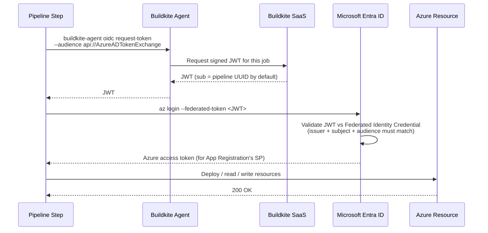

Howdy Folks,

A few weeks ago, I published [Buildkite CI/CD Pipelines for Azure — From CLI Login to Full Bicep Deployments](). At the end of that post, I had a slightly awkward note about OIDC:

> Buildkite also supports OIDC. However, getting Buildkite OIDC to work with Azure requires several non-trivial steps. Documentation was getting updated by the time I write this post.

Well, the documentation has landed. Buildkite published a proper, end-to-end [OIDC with Azure guide](https://buildkite.com/docs/pipelines/security/oidc/azure), and it's actually pretty clean. Even better — there's now genuine flexibility in **how** you scope the trust relationship: per pipeline, per cluster, per queue, or even organization-wide.

So let's cut to the chase. In this post we're going to:

1. Kill off the client secrets from the previous post
2. Understand the four subject claim options Buildkite gives you (and when to pick each one)
3. Retrofit the Bicep pipeline so it authenticates with **zero stored credentials**
4. Talk honestly about the trade-offs — because OIDC is great, but it's not magic

Let's dive in!

---

## Quick Refresher — Why OIDC at All?

If you read the previous post, you'll remember we authenticated using a service principal with a **client secret** stored in Buildkite Secrets:

```bash
az login --service-principal \
  --username "${AZURE_CLIENT_ID}" \
  --password "${AZURE_CLIENT_SECRET}" \
  --tenant   "${AZURE_TENANT_ID}"
```

It works. It's secure-ish. But that secret has to live somewhere, it has to be rotated, and if it leaks, you have a problem until someone notices.

**OIDC removes the secret entirely.** Instead of a long-lived password, your Buildkite agent asks Buildkite for a short-lived signed JWT at runtime. Azure validates that JWT against a **federated identity credential** you configured on an App Registration, and if it matches, Azure hands back a real access token.

> The token is short-lived (5 minutes by default) and never written to disk. Each pipeline step requests its own token — they cannot be passed between steps.
{: .prompt-info }

Microsoft's underlying feature here is called [Workload Identity Federation](https://learn.microsoft.com/entra/workload-id/workload-identity-federation), and it's the same mechanism GitHub Actions and Azure DevOps use under the hood.

---

## The Four Trust Scopes — Pipeline, Cluster, Queue, Organization

This is the part of the new Buildkite docs that genuinely surprised me, and it's worth understanding before you start clicking around in the Azure portal.

By default, the `sub` claim in a Buildkite OIDC token contains the **pipeline UUID**. Azure's federated identity credential matches on that subject *exactly*. So out of the box, **one pipeline = one federated credential = one App Registration trust relationship**.

But Buildkite's `--subject-claim` flag lets you swap that out for a different immutable identifier:

| Subject Claim | What It Trusts | When To Use |
|---|---|---|
| `pipeline_id` *(default)* | A single pipeline | Tightest scoping. Best for production deploys where each pipeline has a clear blast radius. |
| `cluster_id` | All pipelines in a Buildkite cluster | Shared infrastructure. Fewer credentials to manage. |
| `queue_id` | All pipelines targeting a specific agent queue | When queues map to environments (e.g. `prod` queue vs `staging` queue). |
| `organization_id` | Every pipeline in your Buildkite org | Broadest scope. One credential covers everything. |
| `build_id`, `job_id`, `agent_id` | A single build/job/agent | Niche — auditing or true one-shot access. |

Source: [Custom subject claims](https://buildkite.com/docs/agent/v3/cli-oidc#custom-subject-claims) in the Buildkite docs.

### So which one should you pick?

Honestly, the answer depends on how your platform team thinks about isolation. Here's how I'd reason about it:

**Pick `pipeline_id` when:**
- You have a small number of high-stakes pipelines (landing zone deploys, prod releases)
- You want each pipeline to have its own App Registration with tightly scoped RBAC
- You don't mind the per-pipeline setup tax

**Pick `cluster_id` when:**
- You've got dozens of pipelines that all deploy similar things into the same environment
- They legitimately share the same trust boundary (e.g. all "non-prod" workloads)
- You'd rather manage one App Registration per cluster than one per pipeline

**Pick `queue_id` when:**
- You use Buildkite agent queues to model environments (a `prod-agents` queue and a `nonprod-agents` queue, for example)
- You want the trust boundary to follow the *agent*, not the pipeline definition

**Pick `organization_id` when:**
- You have very few users, full trust internally, and you want one credential to rule them all
- You're doing a quick proof-of-concept

{: .prompt-warning }

---

## How the Token Exchange Actually Works

Before we configure anything, here's the flow end-to-end. This helped me a lot when I was debugging why my first attempt didn't work:



The two things Azure cares about most are:

1. The **issuer** — must be `https://agent.buildkite.com`
2. The **subject** — must *exactly* match the `sub` claim in the JWT

Get either wrong and you'll see the dreaded `AADSTS70021: No matching federated identity record found`.

---

## Setting It Up — Step by Step

### Step 1 — Register an App in Microsoft Entra ID

Same as before, but this time we're not generating a client secret. Just the app registration.

```bash
# Create the App Registration only — no secret
az ad app create --display-name "buildkite-oidc-bicep"

# Grab the appId from the output, then create the service principal
APP_ID=$(az ad app list --display-name "buildkite-oidc-bicep" --query "[0].appId" -o tsv)
az ad sp create --id "$APP_ID"
```

Note the **Application (client) ID** and **Directory (tenant) ID** — you'll need them as pipeline env vars. Neither is a secret.

### Step 2 — Add the Federated Identity Credential

This is the trust relationship. In the Azure portal:

1. Open your App Registration → **Certificates & secrets** → **Federated credentials**
2. Click **Add credential**
3. Choose **Other issuer** as the scenario
4. Fill in the fields:

| Field | Value |
|---|---|
| Issuer | `https://agent.buildkite.com` |
| Subject identifier | *Depends on your subject claim* (see below) |
| Name | Something descriptive, e.g. `buildkite-bicep-landingzone` |
| Audience | `api://AzureADTokenExchange` *(leave as default)* |

**The Subject identifier is the part that catches most people out.** It must match the `sub` claim in your token *byte for byte*.

| If your script uses... | Set Subject identifier to... |
|---|---|
| `--subject-claim pipeline_id` *(or no flag at all)* | The pipeline UUID — find it in **Pipeline Settings → General → Pipeline ID** |
| `--subject-claim cluster_id` | The cluster UUID — find it in **Cluster Settings** |
| `--subject-claim queue_id` | The queue UUID — found in your cluster's queues list |
| `--subject-claim organization_id` | The organization UUID — from your org settings |

> For Azure Government use `api://AzureADTokenExchangeUSGov`, and for Azure China use `api://AzureADTokenExchangeChina`. Don't change the audience to a custom value — Azure will reject the token. ([reference](https://buildkite.com/docs/pipelines/security/oidc/azure))
{: .prompt-warning }

You can also do all of this with Bicep, which is much nicer for repeatable platform setups:

```bicep
resource app 'Microsoft.Graph/applications@v1.0' = {
  uniqueName: 'buildkite-oidc-bicep'
  displayName: 'buildkite-oidc-bicep'

  resource fic 'federatedIdentityCredentials@v1.0' = {
    name: 'buildkite-bicep-landingzone'
    issuer: 'https://agent.buildkite.com'
    // For pipeline-scoped trust, use the pipeline UUID.
    // For cluster-scoped trust, use the cluster UUID instead.
    subject: '<pipeline-or-cluster-uuid>'
    audiences: [
      'api://AzureADTokenExchange'
    ]
  }
}
```

> The `Microsoft.Graph` Bicep resource provider is in preview — it requires the [Microsoft Graph Bicep extension](https://learn.microsoft.com/graph/templates/overview-bicep-templates-for-graph). For production, an `az` CLI bootstrap script is still the most reliable path.
{: .prompt-info }

### Step 3 — Assign RBAC

Same as before — give the App Registration's service principal whatever roles it needs. Nothing special about OIDC here. For our Bicep landing zone pipeline:

```bash
SP_OBJECT_ID=$(az ad sp show --id "$APP_ID" --query id -o tsv)

# Owner at subscription scope (only if you're assigning roles in your Bicep)
az role assignment create \
  --assignee-object-id "$SP_OBJECT_ID" \
  --assignee-principal-type ServicePrincipal \
  --role "Owner" \
  --scope "/subscriptions/<your-subscription-id>"
```

If you're not assigning roles in your Bicep, **Contributor** is enough. Stick to least privilege.

### Step 4 — Configure Pipeline Environment Variables

The three Azure identifiers are *not* secrets. Put them straight in your pipeline YAML:

```yaml
env:
  ARM_CLIENT_ID:       "00xx0x0-0x00-0x00-xx00-x0x000xxx0x0"
  ARM_TENANT_ID:       "00xx0x0-0x00-0x00-xx00-x0x000xxx0x0"
  ARM_SUBSCRIPTION_ID: "00xx0x0-0x00-0x00-xx00-x0x000xxx0x0"
```

If your org policy forbids identifiers in source control, store them as Buildkite Secrets instead — the variable names are up to you. Just remember Buildkite Secrets requires agent **v3.106.0 or later** for this pattern.

### Step 5 — Request the Token in the Pipeline

This is the new bit. In each step that needs Azure access:

```bash
# Pipeline-scoped (default subject claim)
BUILDKITE_OIDC_TOKEN=$(buildkite-agent oidc request-token \
  --audience "api://AzureADTokenExchange")

# Cluster-scoped
BUILDKITE_OIDC_TOKEN=$(buildkite-agent oidc request-token \
  --audience "api://AzureADTokenExchange" \
  --subject-claim cluster_id)
```

Then exchange it for an Azure access token:

```bash
az login --service-principal \
  --username "$ARM_CLIENT_ID" \
  --tenant   "$ARM_TENANT_ID" \
  --federated-token "$BUILDKITE_OIDC_TOKEN"
```

That's it. No password. No secret. No rotation calendar.

---

## Retrofitting the Bicep Pipeline From the Previous Post

Remember [`az-login.sh`](#key-scripts) from the last post? Here's the OIDC version. It drops in as a direct replacement:

```bash
#!/bin/bash
# .buildkite/scripts/az-login-oidc.sh
set -euo pipefail

echo "--- :key: Requesting OIDC token from Buildkite"

# Default to pipeline-scoped trust. Override by setting
# BUILDKITE_OIDC_SUBJECT_CLAIM=cluster_id (or queue_id, organization_id)
# in your pipeline env block.
SUBJECT_CLAIM_FLAG=""
if [ -n "${BUILDKITE_OIDC_SUBJECT_CLAIM:-}" ]; then
  SUBJECT_CLAIM_FLAG="--subject-claim ${BUILDKITE_OIDC_SUBJECT_CLAIM}"
  echo "Using custom subject claim: ${BUILDKITE_OIDC_SUBJECT_CLAIM}"
fi

# shellcheck disable=SC2086
BUILDKITE_OIDC_TOKEN=$(buildkite-agent oidc request-token \
  --audience "api://AzureADTokenExchange" \
  ${SUBJECT_CLAIM_FLAG})

echo "--- :azure: Logging in to Azure with federated token"

az login --service-principal \
  --username        "${ARM_CLIENT_ID}" \
  --tenant          "${ARM_TENANT_ID}" \
  --federated-token "${BUILDKITE_OIDC_TOKEN}" \
  --output none

az account set --subscription "${ARM_SUBSCRIPTION_ID}"

echo "✅ Federated login successful"
az account show --query "{name:name, id:id, tenantId:tenantId}" -o table
```

And the pipeline YAML becomes even cleaner — no more `buildkite-agent secret get` calls, no more `AZURE_CLIENT_SECRET`:

```yaml
env:
  ARM_CLIENT_ID:       "your-application-client-id"
  ARM_TENANT_ID:       "your-directory-tenant-id"
  ARM_SUBSCRIPTION_ID: "your-subscription-id"
  # Optional: override the trust scope
  # BUILDKITE_OIDC_SUBJECT_CLAIM: "cluster_id"

  BICEP_TEMPLATE_FILE_PATH: "bicep/main.bicep"
  BICEP_DEPLOYMENT_NAME:    "deploy_bicep"
  AZURE_DEPLOYMENT_TYPE:    "subscription"

steps:
  - label: ":bicep: Lint & Build"
    key: "build"
    command:
      - "bash .buildkite/scripts/install-az.sh"
      - "bash .buildkite/scripts/az-login-oidc.sh"
      - "bash .buildkite/scripts/bicep-install.sh"
      - "bash .buildkite/scripts/bicep-build.sh"
    artifact_paths:
      - "deploy/**"

  - wait

  - label: ":mag: What-If"
    command:
      - "bash .buildkite/scripts/install-az.sh"
      - "bash .buildkite/scripts/az-login-oidc.sh"
      - "bash .buildkite/scripts/bicep-install.sh"
      - "buildkite-agent artifact download 'deploy/**' ."
      - "bash .buildkite/scripts/bicep-whatif.sh"

  - wait

  - block: ":rocket: Approve Deployment"
    if: build.branch == "main"

  - label: ":azure: Deploy"
    if: build.branch == "main"
    command:
      - "bash .buildkite/scripts/install-az.sh"
      - "bash .buildkite/scripts/az-login-oidc.sh"
      - "bash .buildkite/scripts/bicep-install.sh"
      - "buildkite-agent artifact download 'deploy/**' ."
      - "bash .buildkite/scripts/bicep-deploy.sh"
```

**One single env var (`BUILDKITE_OIDC_SUBJECT_CLAIM`) lets you switch the entire pipeline between pipeline-scoped and cluster-scoped trust without touching any scripts.** That's the kind of design payoff you get from keeping logic in shell scripts driven by environment variables.

---

## Pipeline-Scoped vs Cluster-Scoped — A Worked Example

Let's paint a realistic picture. Say you have:

- **2 production pipelines** (`landing-zone-prod`, `app-platform-prod`) deploying into the same prod subscription
- **5 non-production pipelines** (`landing-zone-nonprod`, `app-platform-nonprod`, `dev-sandbox`, `experiment-1`, `experiment-2`)

You could set this up two different ways:

### Option A — Pipeline-scoped (`pipeline_id`)

- **7 App Registrations**, one per pipeline
- **7 Federated Identity Credentials**, one per App Registration
- Each App Reg gets RBAC scoped to *exactly* what that pipeline needs
- Blast radius if a single pipeline is compromised: just that pipeline's resources

### Option B — Cluster-scoped (`cluster_id`)

- **2 App Registrations** — one for the `prod` cluster, one for the `nonprod` cluster
- **2 Federated Identity Credentials**
- Each App Reg gets RBAC scoped to its environment's resources
- Blast radius if any *one* pipeline in the cluster is compromised: anything in that environment

### Pros and Cons

| | Pipeline-scoped | Cluster-scoped |
|---|---|---|
| **Setup time** | High (1 per pipeline) | Low (1 per environment) |
| **Blast radius** | Tight | Broad — all pipelines in cluster share the same trust |
| **RBAC granularity** | Per-pipeline | Per-cluster only |
| **Onboarding new pipelines** | Requires platform team to create new App Reg + FIC | Just add the pipeline to the cluster |
| **Audit clarity in Entra sign-in logs** | Excellent — you see *which* pipeline signed in | Decent — you see the cluster, but not which pipeline |
| **Best for** | Production, regulated workloads | Dev/test, large fleets of similar pipelines |

In real-world platform engineering, I usually end up with a **hybrid**: cluster-scoped credentials for non-prod environments where speed matters, and pipeline-scoped credentials for anything that touches production.

---

## A Few Things Worth Knowing Before You Ship It

OIDC is a genuine step forward, and Buildkite's own [Known limitations section](https://buildkite.com/docs/pipelines/security/oidc/azure#known-limitations) does a really good job of being upfront about the edges. None of these are deal-breakers — they're just things to factor into your design. I'm pulling everything below straight from the official docs so you can see exactly what Buildkite says.

### 1. Azure federation matches on the `sub` claim only

> *"Azure's federated identity credentials match on the `sub` claim only. You can't restrict Azure access by branch, build source, or other build context."* — [Buildkite docs](https://buildkite.com/docs/pipelines/security/oidc/azure#known-limitations-access-control-is-scoped-to-a-single-identifier)

In practice, this means your trust boundary is whatever you put in the subject claim — a pipeline, a cluster, a queue, or the org. You can't add extra "and only on the main branch" conditions at the Entra level. The way you compensate for this is on the *Buildkite* side, by controlling which pipelines exist and who can trigger them. Buildkite's pipeline-level permissions cover that nicely.

### 2. Builds from untrusted sources share the same trust

This one is worth quoting in full because Buildkite explains it clearly:

> *"Because OIDC trust is tied to the token's subject claim, it doesn't distinguish between a build triggered from `main` and one triggered by an unreviewed pull request. If your pipeline accepts public pull requests and has build forks enabled, anyone who can open a PR against that repo can add a step that requests an OIDC token and hits your Azure resources with whatever RBAC roles you've assigned."* — [Buildkite docs](https://buildkite.com/docs/pipelines/security/oidc/azure#known-limitations-untrusted-builds-can-authenticate-to-azure)

This isn't unique to Buildkite — it's how OIDC works across every CI/CD platform that supports it. Buildkite's docs link out to a [Palo Alto Unit 42 talk at DEF CON 32](https://unit42.paloaltonetworks.com/oidc-misconfigurations-in-ci-cd/) and the [tj-actions supply chain incident](https://openssf.org/blog/2025/06/11/maintainers-guide-securing-ci-cd-pipelines-after-the-tj-actions-and-reviewdog-supply-chain-attacks/) for context on what this class of issue looks like in the wild.

The good news is the mitigations are all standard practice — Buildkite [recommends](https://buildkite.com/docs/pipelines/security/oidc/azure#known-limitations-untrusted-builds-can-authenticate-to-azure) the same things you'd do anywhere:

- Separate CI from CD — only put OIDC on the deploy pipeline you control
- Scope RBAC roles to the minimum required (Microsoft's [Azure RBAC best practices](https://learn.microsoft.com/azure/role-based-access-control/best-practices) are a solid starting point)
- Restrict who can trigger builds with [Buildkite pipeline-level permissions](https://buildkite.com/docs/pipelines/security/permissions)
- Monitor service principal sign-ins in Entra
- For Entra ID P1/P2 customers, layer on [Conditional Access for workload identities](https://learn.microsoft.com/entra/identity/conditional-access/workload-identity)

### 3. Tokens are per-step by design

> *"Each step in a Buildkite pipeline runs independently. If multiple steps need Azure access, each step must request its own OIDC token. Tokens cannot be passed between steps."* — [Buildkite docs](https://buildkite.com/docs/pipelines/security/oidc/azure#step-5-request-an-oidc-token-in-your-pipeline)

This is genuinely a *good* design choice — short-lived, narrowly-scoped tokens are exactly what you want. It just means every step that talks to Azure needs to call `buildkite-agent oidc request-token` and `az login` again. The `az-login-oidc.sh` pattern I showed above handles this transparently.

### 4. Watch out for the storage data plane role

Not really a limitation — more of a "don't get caught by this" note that Buildkite calls out in their [troubleshooting section](https://buildkite.com/docs/pipelines/security/oidc/azure#troubleshooting-storage-account-key-access-is-disabled):

> *"If you've disabled shared key access on a storage account (recommended), make sure the service principal has the **Storage Blob Data Contributor** role on the storage account, not just **Contributor**."*

The Contributor role gives you management plane access; the data plane needs its own role. Worth knowing on day one rather than discovering it during a deploy.

---

## When To Use OIDC vs When to Stick With Client Secrets

> If you're deploying anything to Azure from Buildkite, you should be using OIDC. Full stop. The only valid reason to keep using client secrets is if you're on an older agent version (< v3.106.0) and you genuinely can't upgrade.
{: .prompt-tip }

That said, here's a honest decision matrix:

**Use OIDC when:**
- Your agent is on a recent version (v3.106.0+)
- You can create App Registrations and Federated Identity Credentials in your Azure tenant
- You want the operational win of "no credential rotation, ever"

**Stick with client secrets temporarily when:**
- You're on an old agent and can't upgrade right now
- Your Azure tenant blocks federated credentials (some highly regulated tenants do this)
- You're prototyping and just want to ship something today (then come back and migrate)

---

## Monitoring — Where Your Sign-Ins Show Up

This caught me out the first time. OIDC sign-ins from Buildkite appear in Entra ID's **Service principal sign-in logs**, *not* the regular user sign-in logs.

To find them:

1. Sign in to the [Entra admin center](https://entra.microsoft.com/)
2. Go to **Identity → Monitoring & health → Sign-in logs**
3. Switch to the **Service principal sign-ins** tab
4. Filter by your App Registration name

Each sign-in shows the source IP, timestamp, and any failure reason. It's invaluable for debugging the inevitable `AADSTS70021` errors when you set this up the first time.

Microsoft Learn has more on what these logs contain: [Sign-in logs in Microsoft Entra ID](https://learn.microsoft.com/entra/identity/monitoring-health/concept-sign-ins).

---

## Troubleshooting Cheat Sheet

| Error | What's wrong | Fix |
|---|---|---|
| `AADSTS70021: No matching federated identity record found` | The token's `sub` doesn't match the FIC's Subject identifier | Check you're using the correct UUID — pipeline UUID by default, or whatever your `--subject-claim` resolves to |
| `AADSTS700016: Application not found in the directory` | Wrong `ARM_CLIENT_ID` or wrong tenant | Verify the App Registration exists in the tenant referenced by `ARM_TENANT_ID` |
| `AuthorizationFailed` when accessing a resource | Authentication worked, but RBAC didn't | Check the service principal has the right role at the right scope |
| `Storage account key access is disabled` | SP has Contributor but not Storage Blob Data Contributor | Add the data plane role on the storage account |
| Token expired errors | Trying to reuse a token across steps | Request a fresh token in each step |

---

## Wrapping Up

OIDC with Azure is no longer the awkward asterisk it was when I wrote the previous Buildkite post. The official docs are solid, the subject claim flexibility is genuinely useful, and the operational improvement over client secrets is significant — no more rotation reminders, no more "where did we store this thing again?", no more secret sprawl in Buildkite settings.

If you've already implemented the Bicep pipelines from [the previous post](), the migration is small: drop in a new `az-login-oidc.sh` script, remove the secret from Buildkite Secrets, set up a Federated Identity Credential in Azure, and you're done.

Just be honest with yourself about the trade-offs. OIDC removes the credential storage problem, but it doesn't remove the "untrusted code in your pipeline" problem. Pick the right subject claim scope for your blast radius, separate CI from CD, and tighten your RBAC.

I'll be updating the [azure-buildkite-pipelines](https://github.com/azurewithdanidu/azure-buildkite-pipelines) repository over the next few days to include the OIDC scripts and a migration guide. Watch that repo if you want to follow along.

Hope this will help someone in need. Until next time...!

---

**References:**
- [Buildkite — OIDC with Azure](https://buildkite.com/docs/pipelines/security/oidc/azure) (the new official guide)
- [Buildkite — OIDC in Buildkite Pipelines](https://buildkite.com/docs/pipelines/security/oidc)
- [Buildkite — `buildkite-agent oidc` CLI reference](https://buildkite.com/docs/agent/v3/cli-oidc)
- [Buildkite — Custom subject claims](https://buildkite.com/docs/agent/v3/cli-oidc#custom-subject-claims)
- [Microsoft Learn — Workload identity federation](https://learn.microsoft.com/entra/workload-id/workload-identity-federation)
- [Microsoft Learn — Considerations for workload identity federation](https://learn.microsoft.com/entra/workload-id/workload-identity-federation-considerations)
- [Microsoft Learn — Conditional Access for workload identities](https://learn.microsoft.com/entra/identity/conditional-access/workload-identity)
- [Microsoft Learn — Best practices for Azure RBAC](https://learn.microsoft.com/azure/role-based-access-control/best-practices)
- [Previous post — Buildkite CI/CD Pipelines for Azure]()
