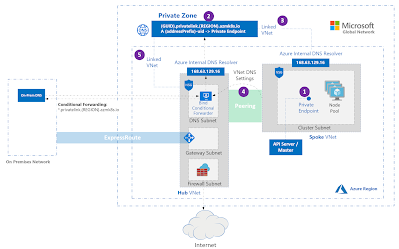

**Do you know that you can now view live monitoring data for private clusters is in public preview.**

**what are private clusters**

Private cluster, you can ensure network traffic between your API server and your node pools remains on the private network only"

**_With this update you can do live monitoring for these private clusters._** 

For more information

https://docs.microsoft.com/en-us/azure/aks/private-clusters

https://docs.microsoft.com/en-us/azure/azure-monitor/insights/container-insights-livedata-overview
