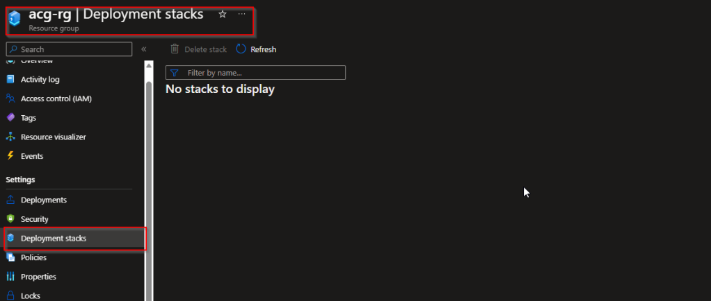

Howdy Folks....

Let's start with an introdzuction to Azure Deployments before we get going on this.

You may already know what I'm going to talk about. Its deployment stacks. A pretty awesome cool new feature for Azure Infrastructure as a code.

Before I say anything here is why you should start using deployment stacks

1. Streamlining the allocation and handling of resources across various areas as a unified unit.

3. Blocking unwanted changes to overseen resources by using denial configurations.

5. Effectively cleaning up the environment using deletion markers during updates to the deployment stack.

7. Using conventional layouts like Bicep, ARM templates, or Template specs in your deployment stacks.

MS Reference - [https://learn.microsoft.com/en-us/azure/azure-resource-manager/bicep/deployment-stacks?tabs=azure-powershell](https://learn.microsoft.com/en-us/azure/azure-resource-manager/bicep/deployment-stacks?tabs=azure-powershell)

  
An Azure deployment stack functions as a particular kind of Azure resource, designed to control a cluster of Azure resources as if they were a single entity. Utilizing either a Bicep file or an ARM JSON template, you can outline the resources governed by the stack when submitting them to a deployment stack. If you remove a resource that was previously in the template, it will be either detached or deleted, depending on the 'actionOnUnmanage' setting chosen within the deployment stack. Similar to other resources in Azure, restrictions to the deployment stack access can be enforced through Azure role-based access control (Azure RBAC).

Creating and modifying a deployment stack can be achieved using Azure CLI, Azure PowerShell, or the Azure portal, in conjunction with Bicep files. These files are converted into ARM JSON templates and then launched as a deployment object by the stack. The deployment stack provides more functions than the standard deployment resources, acting as an extended set of those capabilities.

The resource type designated for deployment stacks is Microsoft.Resources/deploymentStacks. It's composed of a main template capable of executing numerous updates across various scopes to the described resources and can prevent any undesired alterations to those resources.

Note that utilizing deployment stacks necessitates Azure PowerShell version 10.1.0 or above, or Azure CLI version 2.50.0 or higher.

## Known Limitations

There are few things to watch out too.

- Deleting resource groups currently bypasses deny assignments.

- Implicitly created resources aren't managed by the stack. Therefore, no deny assignments or cleanup is possible.

- [What-if](https://learn.microsoft.com/en-us/azure/azure-resource-manager/bicep/deploy-what-if) isn't available in the preview.

- Management group scoped deployment stacks can only deploy the template to subscription.

- When using the Azure CLI create command to modify an existing stack, the deployment process continues regardless of whether you choose _n_ for a prompt. To halt the procedure, use _\[CTRL\] + C_.

- If you create or modify a deployment stack in the Azure portal, deny settings will be overwritten (support for deny settings in the Azure portal is currently in progress).

- Management group deployment stacks are not yet available in the Azure portal.

## How to use

There are few key features

- Create

- Update

- Delete

- List

And also, deployment stacks can be deployed at all 3 resource deployment levels. Which are known as

- Resource Group

- Subscriptions

- Management Group

Following deployments are at subscription. level

### Create
